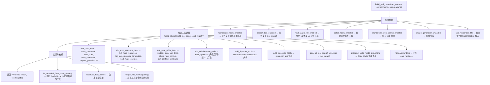

# Codex Agent 工具（Tools）分析

> 日期：2026-07-30
> 项目：openai/codex
> 验证：所有 wire name 锚定到 `ToolName::plain()` / `ToolName::namespaced()` 实际返回值

---

## 架构概述

Codex Agent 的工具系统通过 **ToolRouter** 在每次模型调用前动态组装。工具来源分为：

```mermaid
flowchart TD
    TR["ToolRouter<br/>(codex-rs/core/src/tools/router.rs)"]
    BTR["build_tool_router()<br/>(codex-rs/core/src/tools/spec_plan.rs)"]
    TR --> BTR
    BTR --> C1["1. Shell/Exec 工具 → shell_spec.rs"]
    BTR --> C2["2. File editing → apply_patch_spec.rs (Freeform/Lark grammar)"]
    BTR --> C3["3. MCP 工具 → mcp.rs (动态生成，每个 MCP server 的 tool 对应一个)"]
    BTR --> C4["4. MCP 资源工具 → mcp_resource_spec.rs"]
    BTR --> C5["5. 协作 v1 → multi_agents_spec.rs (命名空间 multi_agent_v1)"]
    BTR --> C6["6. 协作 v2 → multi_agents_v2/*.rs (扁平工具)"]
    BTR --> C7["7. 核心实用工具 → plan_spec, current_time, sleep, new_context_window,<br/>get_context_remaining, view_image, wait_for_environment"]
    BTR --> C8["8. 请求工具 → request_user_input_spec, request_permissions"]
    BTR --> C9["9. 插件/连接器 → list_available_plugins_to_install_spec, request_plugin_install_spec"]
    BTR --> C10["10. 工具发现 → tool_search_spec (BM25 搜索)"]
    BTR --> C11["11. 动态工具 → dynamic.rs (DynamicToolFunctionSpec)"]
    BTR --> C12["12. 扩展工具 → extension_tools.rs (extension_api::ToolExecutor)"]
    BTR --> C13["13. 等待环境 → wait_for_environment.rs"]
    BTR --> C14["14. Code Mode → code_mode/execute_spec, code_mode/wait_spec"]
    BTR --> C15["15. 测试工具 → test_sync_spec (仅集成测试用)"]
```



**ToolSpec 四种变体**：

- `Function(ResponsesApiTool)` — 标准 function calling
- `Namespace(ResponsesApiNamespace)` — 命名空间分组（仅 v1 multi_agent 使用）
- `Freeform(FreeformTool)` — 自定义语法（apply_patch 的 lark, code_mode 的 exec）
- `ToolSearch` / `WebSearch` — 动态工具发现

---

## 完整工具清单

### 1. 执行工具

#### `exec_command`

| 字段            | 值                                                                                                                                                                |
| --------------- | ----------------------------------------------------------------------------------------------------------------------------------------------------------------- |
| **名称**        | `exec_command`                                                                                                                                                    |
| **命名空间**    | 无（扁平）                                                                                                                                                        |
| **定义源**      | `shell_spec.rs` / `shell_spec_tests.rs`                                                                                                                           |
| **wire name**   | `ToolName::plain("exec_command")`                                                                                                                                 |
| **描述**        | "Runs a command in a PTY, returning output or a session ID for ongoing interaction."                                                                              |
| **参数**        | `cmd` (string, 必需), `workdir` (string), `shell` (string), `tty` (bool), `yield_time_ms` (number), `max_output_tokens` (number), `login` (bool), + approval 参数 |
| **输出 schema** | `unified_exec_output_schema()`                                                                                                                                    |
| **实现**        | `unified_exec/exec_command.rs` (ExecCommandHandler)                                                                                                               |

#### `write_stdin`

| 字段            | 值                                                                                                    |
| --------------- | ----------------------------------------------------------------------------------------------------- |
| **名称**        | `write_stdin`                                                                                         |
| **命名空间**    | 无（扁平）                                                                                            |
| **定义源**      | `shell_spec.rs` / `shell_spec_tests.rs`                                                               |
| **wire name**   | `ToolName::plain("write_stdin")`                                                                      |
| **描述**        | "Writes characters to an existing unified exec session and returns recent output."                    |
| **参数**        | `session_id` (number, 必需), `chars` (string), `yield_time_ms` (number), `max_output_tokens` (number) |
| **输出 schema** | `unified_exec_output_schema()`                                                                        |
| **实现**        | `unified_exec/write_stdin.rs` (WriteStdinHandler)                                                     |

#### `shell_command`

| 字段            | 值                                                                                                   |
| --------------- | ---------------------------------------------------------------------------------------------------- |
| **名称**        | `shell_command`                                                                                      |
| **命名空间**    | 无（扁平）                                                                                           |
| **定义源**      | `shell_spec.rs` / `shell_spec_tests.rs`                                                              |
| **wire name**   | `ToolName::plain("shell_command")`                                                                   |
| **描述**        | "Runs a shell command and returns its output."                                                       |
| **参数**        | `command` (string, 必需), `workdir` (string), `timeout_ms` (number), `login` (bool), + approval 参数 |
| **输出 schema** | 无                                                                                                   |
| **实现**        | `shell/shell_command.rs` (ShellCommandHandler)                                                       |

---

### 2. 文件编辑

#### `apply_patch`

| 字段            | 值                                                                                                             |
| --------------- | -------------------------------------------------------------------------------------------------------------- |
| **名称**        | `apply_patch`                                                                                                  |
| **类型**        | **Freeform** (lark grammar)                                                                                    |
| **定义源**      | `apply_patch_spec.rs` / `apply_patch_spec_tests.rs`                                                            |
| **wire name**   | `ToolName::plain("apply_patch")`                                                                               |
| **描述**        | "The `apply_patch` tool can be used to edit files. This is a FREEFORM tool, so do not wrap the patch in JSON." |
| **语法**        | Lark grammar（定义于 `apply_patch.lark`）                                                                      |
| **输出 schema** | 无（自由格式）                                                                                                 |
| **实现**        | `apply_patch.rs` (ApplyPatchHandler)                                                                           |

---

### 3. MCP 工具（动态生成）

| 字段          | 值                                                                    |
| ------------- | --------------------------------------------------------------------- |
| **名称**      | 每个 MCP server 注册的 tool 名称（如 `create_event`, `lookup_order`） |
| **命名空间**  | `mcp__<server_name>__<tool_name>`                                     |
| **定义源**    | `mcp.rs` / `mcp_tool.rs` (`parse_mcp_tool`)                           |
| **wire name** | `ToolName::namespaced(namespace, tool_name)`                          |
| **描述**      | 由 MCP server 的 tool 定义动态生成                                    |
| **参数**      | MCP server 的 JSON schema                                             |
| **实现**      | `mcp.rs` (McpHandler)                                                 |

---

### 4. MCP 资源工具

#### `list_mcp_resources`

| 字段         | 值                                                                                         |
| ------------ | ------------------------------------------------------------------------------------------ |
| **名称**     | `list_mcp_resources`                                                                       |
| **命名空间** | 无（扁平）                                                                                 |
| **定义源**   | `mcp_resource_spec.rs` / `mcp_resource_spec_tests.rs`                                      |
| **描述**     | "Lists resources provided by MCP servers. Prefer resources over web search when possible." |
| **参数**     | `server` (string), `cursor` (string)                                                       |
| **实现**     | `mcp_resource/list_mcp_resources.rs`                                                       |

#### `list_mcp_resource_templates`

| 字段         | 值                                                                                                           |
| ------------ | ------------------------------------------------------------------------------------------------------------ |
| **名称**     | `list_mcp_resource_templates`                                                                                |
| **命名空间** | 无（扁平）                                                                                                   |
| **定义源**   | `mcp_resource_spec.rs` / `mcp_resource_spec_tests.rs`                                                        |
| **描述**     | "Lists resource templates provided by MCP servers. Prefer resource templates over web search when possible." |
| **参数**     | `server` (string), `cursor` (string)                                                                         |
| **实现**     | `mcp_resource/list_mcp_resource_templates.rs`                                                                |

#### `read_mcp_resource`

| 字段         | 值                                                                                    |
| ------------ | ------------------------------------------------------------------------------------- |
| **名称**     | `read_mcp_resource`                                                                   |
| **命名空间** | 无（扁平）                                                                            |
| **定义源**   | `mcp_resource_spec.rs` / `mcp_resource_spec_tests.rs`                                 |
| **描述**     | "Read a specific resource from an MCP server given the server name and resource URI." |
| **参数**     | `server` (string, 必需), `uri` (string, 必需)                                         |
| **实现**     | `mcp_resource/read_mcp_resource.rs`                                                   |

---

### 5. 协作工具 v1（命名空间：`multi_agent_v1`）

定义于 `multi_agents_spec.rs`，以下所有工具的 wire name 为 `ToolName::namespaced("multi_agent_v1", name)`：

#### `spawn_agent` (v1)

**定义源**: `multi_agents_spec.rs` (`create_spawn_agent_tool_v1`, `spawn_agent_common_properties_v1`, `spawn_agent_output_schema_v1`)

- **参数**: `message` (string, 初始任务，必需), `items` (array of structured input items), `agent_type` (string), `fork_context` (bool), `model` (string), `reasoning_effort` (string), `service_tier` (string)
- **输出 schema**: `{agent_id: string, nickname: string|null}` (必需: `agent_id`, `nickname`)

#### `send_input` (v1)

**定义源**: `multi_agents_spec.rs` (`create_send_input_tool_v1`, `send_input_output_schema`)

- **描述**: "Send a message to an existing agent. Use interrupt=true to redirect work immediately. You should reuse the agent by send_input if you believe your assigned task is highly dependent on the context of a previous task."
- **参数**: `target` (string, 必需), `message` (string), `items` (array of structured input items), `interrupt` (bool)
- **输出 schema**: `{submission_id: string}` (必需)

#### `wait_agent` (v1)

**定义源**: `multi_agents_spec.rs` (`create_wait_agent_tool_v1`, `wait_agent_tool_parameters_v1`, `wait_output_schema_v1`)

- **描述**: "Wait for agents to reach a final status. Completed statuses may include the agent's final message. Returns empty status when timed out."
- **参数**: `targets` (array of strings, 必需 — agent ids to wait on), `timeout_ms` (number — defaults to 300000, min 60000, max 300000)
- **输出 schema**: `{status: {<agent_id>: agent_status>, ...}, timed_out: boolean}` (必需: `status`, `timed_out`)

#### `resume_agent` (v1)

**定义源**: `multi_agents_spec.rs` (`create_resume_agent_tool`, `resume_agent_output_schema`)

- **描述**: "Resume a previously closed agent by id so it can receive send_input and wait_agent calls."
- **参数**: `id` (string, 必需)
- **输出 schema**: `{status: agent_status}` (必需)

#### `close_agent` (v1)

**定义源**: `multi_agents_spec.rs` (`create_close_agent_tool_v1`, `agent_previous_status_output_schema`)

- **描述**: "Close an agent and any open descendants when they are no longer needed, and return the target agent's previous status before shutdown was requested. Completed agents remain open and count toward the concurrency limit until closed. Don't keep agents open for too long if they are not needed anymore."
- **参数**: `target` (string, 必需)
- **输出 schema**: `{previous_status: agent_status}` (必需)

---

### 6. 协作工具 v2（扁平工具）

定义于 `multi_agents_v2/*.rs`，所有工具直接暴露在根级别：

#### `spawn_agent` (v2)

**定义源**: `multi_agents_spec.rs` (`create_spawn_agent_tool_v2`, `spawn_agent_common_properties_v2`, `spawn_agent_output_schema_v2`)

- **描述**: "Spawn a new agent to handle a specific task."
- **参数**: `task_name` (string, 必需), `message` (string, 必需, 加密), `agent_type` (string), `fork_turns` (string, 默认 "all", 可用 "none", "all", 或正整数), `model` (string, 可选), `reasoning_effort` (string, 可选), `service_tier` (string, 可选)
- **输出 schema**: `{task_name: string, nickname: string|null}` (必需: `task_name`, `nickname`)
  - 当 `hide_agent_metadata=true` 时仅返回 `{task_name: string}` (必需)

#### `send_message`

**定义源**: `multi_agents_spec.rs` (`create_send_message_tool`)

- **描述**: "Send a message to an existing agent. The message will be delivered promptly. Does not trigger a new turn."
- **参数**: `target` (string, 必需), `message` (string, 必需, 加密)
- **输出 schema**: 无

#### `followup_task`

**定义源**: `multi_agents_spec.rs` (`create_followup_task_tool`)

- **描述**: "Send a follow-up task to an existing non-root target agent and trigger a turn if it is idle. If the target is already running, deliver the task promptly at message boundaries while sampling, or after the pending tool call completes."
- **参数**: `target` (string, 必需), `message` (string, 必需, 加密)
- **输出 schema**: 无

#### `wait_agent` (v2)

**定义源**: `multi_agents_spec.rs` (`create_wait_agent_tool_v2`, `wait_agent_tool_parameters_v2`, `wait_output_schema_v2`)

- **描述**: "Wait for a mailbox update from any live agent, including queued messages and final-status notifications. The wait also ends early when new user input is steered into the active turn. Does not return the content; returns either a summary of which agents have updates (if any), an interruption summary for steered input, or a timeout summary if no activity arrives before the deadline."
- **参数**: `timeout_ms` (number — defaults to 300000, min 60000, max 300000)
- **输出 schema**: `{message: string, timed_out: boolean}` (必需)

#### `interrupt_agent`

**定义源**: `multi_agents_spec.rs` (`create_interrupt_agent_tool_v2`, `agent_previous_status_output_schema`)

- **描述**: "Interrupt an agent's current turn, if any, and return its previous status. The agent remains available for messages and follow-up tasks."
- **参数**: `target` (string, 必需)
- **输出 schema**: `{previous_status: agent_status}` (必需)

#### `list_agents`

**定义源**: `multi_agents_spec.rs` (`create_list_agents_tool`, `list_agents_output_schema`)

- **描述**: "List live agents in the current root thread tree. Optionally filter by task-path prefix."
- **参数**: `path_prefix` (string)
- **输出 schema**: `{agents: [{agent_name: string, agent_status: agent_status}]}` (必需: `agents`)

---

### 7. 核心实用工具

#### `update_plan`

| 字段            | 值                                                                                                                                                             |
| --------------- | -------------------------------------------------------------------------------------------------------------------------------------------------------------- | ------------- | --------------------- |
| **名称**        | `update_plan`                                                                                                                                                  |
| **命名空间**    | 无（扁平）                                                                                                                                                     |
| **定义源**      | `plan_spec.rs`                                                                                                                                                 |
| **wire name**   | `ToolName::plain("update_plan")`                                                                                                                               |
| **描述**        | "Updates the task plan. Provide an optional explanation and a list of plan items, each with a step and status. At most one step can be in_progress at a time." |
| **参数**        | `explanation` (string), `plan` (array<{step: string, status: enum["pending"                                                                                    | "in_progress" | "completed">]}, 必需) |
| **输出 schema** | 无                                                                                                                                                             |
| **实现**        | `plan.rs` (PlanHandler)                                                                                                                                        |

#### `curr_time` ⚠️ wire name is `curr_time` (NOT `current_time`)

| 字段            | 值                                                                     |
| --------------- | ---------------------------------------------------------------------- |
| **名称**        | `curr_time`（文件名为 `current_time.rs`，但 wire name 是 `curr_time`） |
| **命名空间**    | `clock`                                                                |
| **定义源**      | `current_time.rs`                                                      |
| **wire name**   | `ToolName::namespaced("clock", "curr_time")`                           |
| **描述**        | "Return the current time in UTC."                                      |
| **参数**        | 无                                                                     |
| **输出 schema** | `{current_time: string}` (格式: "YYYY-MM-DD HH:MM:SS UTC")             |
| **实现**        | `current_time.rs` (CurrentTimeHandler)                                 |

#### `sleep`

| 字段            | 值                                                                   |
| --------------- | -------------------------------------------------------------------- |
| **名称**        | `sleep`                                                              |
| **命名空间**    | `clock`                                                              |
| **定义源**      | `sleep.rs`                                                           |
| **wire name**   | `ToolName::namespaced("clock", "sleep")`                             |
| **描述**        | "Sleep for a specified duration."                                    |
| **参数**        | `duration_ms` (number, 必需) — 最大值 12 _ 60 _ 60 \* 1000 (12 小时) |
| **输出 schema** | 无                                                                   |
| **暴露**        | `ToolExposure::DirectModelOnly`（模型直接可用）                      |
| **实现**        | `sleep.rs` (SleepHandler)                                            |

#### `new_context` ⚠️ wire name is `new_context` (NOT `new_context_window`)

| 字段            | 值                                                                                          |
| --------------- | ------------------------------------------------------------------------------------------- |
| **名称**        | `new_context`（文件名为 `new_context_window_spec.rs`，但 wire name 是 `new_context`）       |
| **命名空间**    | 无（扁平）                                                                                  |
| **定义源**      | `new_context_window_spec.rs`                                                                |
| **wire name**   | `ToolName::plain("new_context")`                                                            |
| **描述**        | "Start a new context window. Does not clear, reset, or otherwise affect environment state." |
| **参数**        | 无                                                                                          |
| **输出 schema** | 无                                                                                          |
| **实现**        | `new_context_window.rs`                                                                     |

#### `get_context_remaining`

| 字段            | 值                                                        |
| --------------- | --------------------------------------------------------- | ------ |
| **名称**        | `get_context_remaining`                                   |
| **命名空间**    | 无（扁平）                                                |
| **定义源**      | `get_context_remaining_spec.rs`                           |
| **wire name**   | `ToolName::plain("get_context_remaining")`                |
| **描述**        | "Get the remaining tokens in the current context window." |
| **参数**        | 无                                                        |
| **输出 schema** | `{tokens_left: integer                                    | null}` |
| **实现**        | `get_context_remaining.rs`                                |

#### `view_image`

| 字段            | 值                                                                                  |
| --------------- | ----------------------------------------------------------------------------------- | --------------------------------------------------- |
| **名称**        | `view_image`                                                                        |
| **命名空间**    | 无（扁平）                                                                          |
| **定义源**      | `view_image_spec.rs`                                                                |
| **wire name**   | `ToolName::plain(VIEW_IMAGE_TOOL_NAME)` where `VIEW_IMAGE_TOOL_NAME = "view_image"` |
| **描述**        | "View a local image file from the filesystem when visual inspection is needed."     |
| **参数**        | `path` (string, 必需), `detail` (enum["high"                                        | "original"], 条件), `environment_id` (string, 条件) |
| **输出 schema** | `{image_url: string, detail: enum["high"                                            | "original"]}`                                       |
| **实现**        | `view_image.rs` (ViewImageHandler)                                                  |

#### `wait_for_environment`

| 字段          | 值                                                                                    |
| ------------- | ------------------------------------------------------------------------------------- |
| **名称**      | `wait_for_environment`                                                                |
| **命名空间**  | 无（扁平）                                                                            |
| **定义源**    | `wait_for_environment.rs`                                                             |
| **wire name** | `ToolName::plain("wait_for_environment")`                                             |
| **描述**      | "Wait for a selected execution environment marked as `starting` to become available." |
| **参数**      | `environment_id` (string, 条件)                                                       |
| **实现**      | `wait_for_environment.rs` (WaitForEnvironmentHandler)                                 |

---

### 8. 请求/交互工具

#### `request_user_input`

| 字段            | 值                                                                                                                          |
| --------------- | --------------------------------------------------------------------------------------------------------------------------- |
| **名称**        | `request_user_input`                                                                                                        |
| **命名空间**    | 无（扁平）                                                                                                                  |
| **定义源**      | `request_user_input_spec.rs` / `request_user_input_spec_tests.rs`                                                           |
| **wire name**   | `ToolName::plain("request_user_input")`                                                                                     |
| **描述**        | "Ask the user to choose."                                                                                                   |
| **参数**        | `autoResolutionMs` (number, 60000-240000), `questions` (array<{id, header, question, options[{label, description}]}>，必需) |
| **输出 schema** | 无                                                                                                                          |
| **实现**        | `request_user_input.rs` (RequestUserInputHandler)                                                                           |

#### `request_permissions`

| 字段            | 值                                                                                                                                                                |
| --------------- | ----------------------------------------------------------------------------------------------------------------------------------------------------------------- |
| **名称**        | `request_permissions`                                                                                                                                             |
| **命名空间**    | 无（扁平）                                                                                                                                                        |
| **定义源**      | `shell_spec.rs` / `shell_spec_tests.rs`                                                                                                                           |
| **wire name**   | `ToolName::plain("request_permissions")`                                                                                                                          |
| **描述**        | "Request extra permissions for this turn."                                                                                                                        |
| **参数**        | `reason` (string), `environment_id` (string), `permissions` (object, 必需 — `network.enabled: bool`, `file_system.read: string[]`, `file_system.write: string[]`) |
| **输出 schema** | 无                                                                                                                                                                |
| **实现**        | `request_permissions.rs` (RequestPermissionsHandler)                                                                                                              |

---

### 9. 插件/连接器发现与安装

#### `list_available_plugins_to_install`

| 字段          | 值                                                                                              |
| ------------- | ----------------------------------------------------------------------------------------------- |
| **名称**      | `list_available_plugins_to_install`                                                             |
| **命名空间**  | 无（扁平）                                                                                      |
| **定义源**    | `list_available_plugins_to_install_spec.rs` / `list_available_plugins_to_install_spec_tests.rs` |
| **wire name** | `ToolName::plain("list_available_plugins_to_install")`                                          |
| **描述**      | "Returns known plugins and connectors that can be passed to `request_plugin_install`."          |
| **参数**      | 无                                                                                              |
| **实现**      | `list_available_plugins_to_install.rs`                                                          |

#### `request_plugin_install`

| 字段                                  | 值                                                                                                                                      |
| ------------------------------------- | --------------------------------------------------------------------------------------------------------------------------------------- |
| **名称**                              | `request_plugin_install`                                                                                                                |
| **命名空间**                          | 无（扁平）                                                                                                                              |
| **定义源**                            | `request_plugin_install_spec.rs`（两种 presentation 模式）                                                                              |
| **wire name**                         | `ToolName::plain("request_plugin_install")`                                                                                             |
| **参数** (ListTool 模式)              | `tool_type` ("connector" 或 "plugin", 必需), `action_type` ("install", 必需), `tool_id` (string, 必需), `suggest_reason` (string, 必需) |
| **参数** (RecommendationContext 模式) | 简化参数                                                                                                                                |
| **实现**                              | `request_plugin_install.rs` (RequestPluginInstallHandler)                                                                               |

---

### 10. 工具发现与搜索

#### `tool_search`

| 字段            | 值                                                                                                   |
| --------------- | ---------------------------------------------------------------------------------------------------- |
| **名称**        | `tool_search`                                                                                        |
| **类型**        | **ToolSearch**（BM25 搜索，Deferred 工具发现）                                                       |
| **定义源**      | `tool_search_spec.rs` / `tool_search.rs`                                                             |
| **wire name**   | `ToolName::plain(TOOL_SEARCH_TOOL_NAME)` where `TOOL_SEARCH_TOOL_NAME = "tool_search"`               |
| **描述**        | "Searches over deferred tool metadata with BM25 and exposes matching tools for the next model call." |
| **参数**        | `query` (string, 必需), `limit` (number, 默认 8)                                                     |
| **输出 schema** | 发现结果（含工具名称、描述）                                                                         |
| **实现**        | `tool_search.rs`（ToolSearchHandler，BM25 搜索引擎 + 缓存）                                          |

---

### 11. Code Mode 专用工具

#### `exec` (code_mode)

| 字段       | 值                                                                             |
| ---------- | ------------------------------------------------------------------------------ |
| **名称**   | `exec`（来自 `code-mode-protocol/src/lib.rs:45`: `PUBLIC_TOOL_NAME = "exec"`） |
| **类型**   | **Freeform** (lark grammar)                                                    |
| **定义源** | `code_mode/execute_spec.rs`                                                    |
| **描述**   | 动态生成，包含可用的嵌套工具列表                                               |
| **语法**   | Lark grammar (PRAGMA_LINE + SOURCE)                                            |
| **实现**   | `code_mode/execute_handler.rs`                                                 |

#### `wait` (code_mode)

| 字段       | 值                                                                           |
| ---------- | ---------------------------------------------------------------------------- |
| **名称**   | `wait`（来自 `code-mode-protocol/src/lib.rs:46`: `WAIT_TOOL_NAME = "wait"`） |
| **类型**   | Freeform                                                                     |
| **定义源** | `code_mode/wait_spec.rs`                                                     |
| **实现**   | `code_mode/wait_handler.rs`                                                  |

---

### 12. 动态/扩展工具

#### 动态工具（Dynamic Tools）

| 字段     | 值                                             |
| -------- | ---------------------------------------------- |
| **名称** | 由 `DynamicToolFunctionSpec.name` 定义         |
| **来源** | `dynamic.rs` (DynamicHandler)                  |
| **描述** | 动态创建的工具（来自外部规范）                 |
| **参数** | 由 `DynamicToolFunctionSpec.input_schema` 定义 |
| **实现** | `dynamic.rs`                                   |

#### 扩展工具（Extension Tools）

| 字段     | 值                                                |
| -------- | ------------------------------------------------- |
| **名称** | 由 `extension_api::ToolExecutor.tool_name()` 定义 |
| **来源** | `extension_tools.rs` (ExtensionToolAdapter)       |
| **描述** | 扩展系统注册的工具                                |
| **参数** | 由扩展定义的 schema                               |
| **实现** | `extension_tools.rs`                              |

---

### 13. 测试工具（仅集成测试）

#### `test_sync_tool`

| 字段          | 值                                                                                                |
| ------------- | ------------------------------------------------------------------------------------------------- |
| **名称**      | `test_sync_tool`                                                                                  |
| **命名空间**  | 无（扁平）                                                                                        |
| **定义源**    | `test_sync_spec.rs` / `test_sync_spec_tests.rs`                                                   |
| **wire name** | `ToolName::plain("test_sync_tool")`                                                               |
| **描述**      | "Internal synchronization helper used by Codex integration tests."                                |
| **参数**      | `sleep_before_ms` (number), `sleep_after_ms` (number), `barrier` ({id, participants, timeout_ms}) |

---

## 工具路由决策逻辑



---

## 工具注册总数

| 类别             | 数量                                                                   |
| ---------------- | ---------------------------------------------------------------------- |
| 核心固定工具     | 20（shell + utils + requests + plugins + MCP resources + tool_search） |
| 协作工具         | 6-12（v1 5 个命名空间 + v2 6 个扁平，根据配置二选一）                  |
| MCP 工具         | 动态（取决于配置的 MCP server）                                        |
| 动态工具         | 动态（取决于 DynamicToolFunctionSpec）                                 |
| 扩展工具         | 动态（取决于 extension_api 注册）                                      |
| Code Mode 工具   | 2（exec + wait）                                                       |
| **总计（最小）** | **~26**                                                                |
| **总计（最大）** | **~35+**                                                               |

---

## 关键数据结构

```rust
// 工具名称 — wire 层面使用
pub struct ToolName {
    namespace: Option<String>,   // 如 Some("clock"), Some("multi_agent_v1")
    name: String,                // 如 "curr_time", "spawn_agent"
}

// 工具规格（模型可见）
pub enum ToolSpec {
    Function(ResponsesApiTool),       // 标准 function calling
    Namespace(ResponsesApiNamespace), // 命名空间分组（仅 v1 multi_agent）
    Freeform(FreeformTool),           // 自定义语法（apply_patch lark, code_mode exec）
    ToolSearch,                       // BM25 搜索
    WebSearch,                        // Web 搜索
}

// 响应式 API 工具
pub struct ResponsesApiTool {
    pub name: String,                 // wire name
    pub description: String,
    pub strict: bool,
    pub defer_loading: Option<bool>,
    pub parameters: JsonSchema,
    pub output_schema: Option<Value>,
}

// 工具执行器 trait
pub trait ToolExecutor<T: ToolInvocation> {
    fn tool_name(&self) -> ToolName;          // wire name 定义处
    fn spec(&self) -> ToolSpec;                // 完整规格
    fn handle(&self, invocation: ToolInvocation) -> ToolExecutorFuture<'_>;
    fn exposure(&self) -> ToolExposure { ToolExposure::Direct };
    fn supports_parallel_tool_calls(&self) -> bool { false }
}
```

---

## Wire Name 锚定表

以下所有 wire name 均从源码 `ToolName::plain()` / `ToolName::namespaced()` 验证：

| 文件名/处理器                               | Wire Name                           | 来源                                                                                |
| ------------------------------------------- | ----------------------------------- | ----------------------------------------------------------------------------------- |
| `unified_exec/exec_command.rs`              | `exec_command`                      | `ToolName::plain("exec_command")`                                                   |
| `unified_exec/write_stdin.rs`               | `write_stdin`                       | `ToolName::plain("write_stdin")`                                                    |
| `shell/shell_command.rs`                    | `shell_command`                     | `ToolName::plain("shell_command")`                                                  |
| `apply_patch.rs`                            | `apply_patch`                       | `ToolName::plain("apply_patch")`                                                    |
| `view_image_spec.rs`                        | `view_image`                        | `ToolName::plain(VIEW_IMAGE_TOOL_NAME)` where `VIEW_IMAGE_TOOL_NAME = "view_image"` |
| `plan_spec.rs`                              | `update_plan`                       | `ToolName::plain("update_plan")`                                                    |
| `current_time.rs`                           | `clock::curr_time`                  | `ToolName::namespaced("clock", "curr_time")` ⚠️                                     |
| `sleep.rs`                                  | `clock::sleep`                      | `ToolName::namespaced("clock", "sleep")`                                            |
| `new_context_window_spec.rs`                | `new_context`                       | `ToolName::plain("new_context")` ⚠️                                                 |
| `get_context_remaining_spec.rs`             | `get_context_remaining`             | `ToolName::plain("get_context_remaining")`                                          |
| `wait_for_environment.rs`                   | `wait_for_environment`              | `ToolName::plain("wait_for_environment")`                                           |
| `request_user_input_spec.rs`                | `request_user_input`                | `ToolName::plain("request_user_input")`                                             |
| `request_permissions.rs`                    | `request_permissions`               | `ToolName::plain("request_permissions")`                                            |
| `tool_search_spec.rs`                       | `tool_search`                       | `ToolName::plain("tool_search")`                                                    |
| `list_available_plugins_to_install_spec.rs` | `list_available_plugins_to_install` | `ToolName::plain("list_available_plugins_to_install")`                              |
| `request_plugin_install_spec.rs`            | `request_plugin_install`            | `ToolName::plain("request_plugin_install")`                                         |
| `code_mode/execute_spec.rs`                 | `exec`                              | `PUBLIC_TOOL_NAME = "exec"`                                                         |
| `code_mode/wait_spec.rs`                    | `wait`                              | `WAIT_TOOL_NAME = "wait"`                                                           |
| `test_sync_spec.rs`                         | `test_sync_tool`                    | `ToolName::plain("test_sync_tool")`                                                 |
| `multi_agents_spec.rs` v1                   | `multi_agent_v1::spawn_agent` 等    | `ToolName::namespaced("multi_agent_v1", ...)`                                       |
| `multi_agents_v2/*.rs`                      | 扁平 (无命名空间)                   | `ToolName::plain("spawn_agent")`, etc.                                              |
