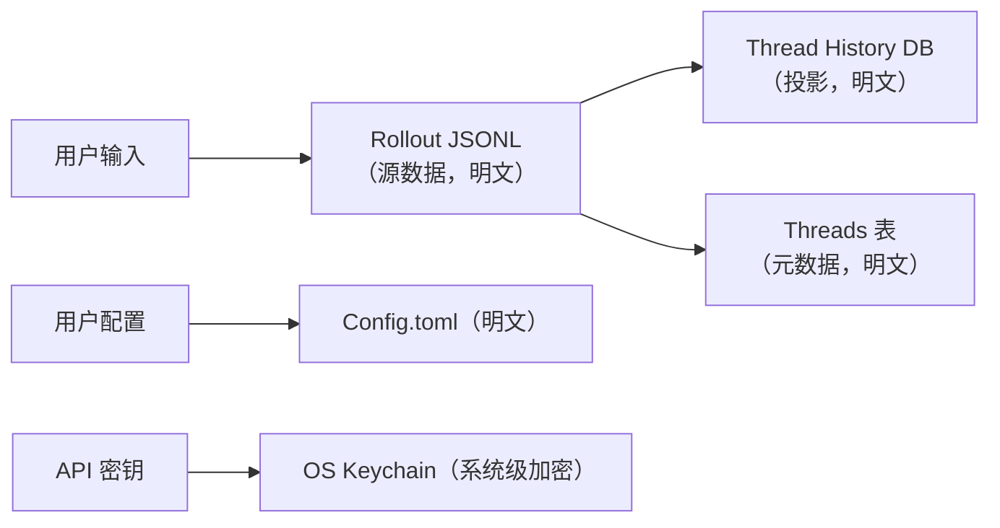

# Codex 数据存储结构分析

本文档分析 Codex 的数据存储架构、SQLite 数据库内容，以及 SQLite 加密的可行性。

## 1. 数据存储架构概述

### 1.1 数据库布局

Codex 使用 **5 个独立的 SQLite 数据库**，存储在单个 `sqlite_home` 目录下：

| 数据库文件 | 数据库名称 | 迁移目录 | 主要用途 |
|-----------|-----------|---------|---------|
| `state_5.sqlite` | State DB | `state/src/migrations/` | 线程元数据、配置、远程控制注册 |
| `logs_2.sqlite` | Log DB | `state/src/logs_migrations/` | 结构化日志记录 |
| `goals_1.sqlite` | Goals DB | `state/src/goals_migrations/` | 线程目标跟踪 |
| `memories_1.sqlite` | Memories DB | `state/src/memory_migrations/` | Stage 1 记忆输出 |
| `thread_history_1.sqlite` | Thread History DB | `state/src/thread_history_migrations/` | 分页线程历史投影 |

**源码位置**：`codex-rs/state/src/sqlite.rs:14-17`

### 1.2 连接配置

所有数据库使用统一的连接配置：

```rust
SqliteConnectOptions::new()
    .filename(path)
    .create_if_missing(true)
    .journal_mode(SqliteJournalMode::Wal)      // WAL 模式
    .synchronous(SqliteSynchronous::Normal)     // 同步模式：Normal
    .auto_vacuum(SqliteAutoVacuum::Incremental) // 增量自动清理
    .busy_timeout(Duration::from_secs(5))      // 忙碌超时：5 秒
    .log_statements(LevelFilter::Off)
```

**源码位置**：`codex-rs/state/src/sqlite.rs:250-257`

连接池配置：
- 最大连接数：5（`SqlitePoolOptions::new().max_connections(5)`）
- 只读模式：最大连接数 1（用于只读池）

### 1.3 数据库版本

通过文件名和迁移目录区分数据库版本：
- `state_5.sqlite`：主状态数据库，版本 5
- `logs_2.sqlite`：日志数据库，版本 2（从 `state_5.sqlite` 迁移出）
- `goals_1.sqlite`：目标数据库，版本 1（从 `state_5.sqlite` 迁移出）
- `memories_1.sqlite`：记忆数据库，版本 1（从 `state_5.sqlite` 迁移出）
- `thread_history_1.sqlite`：线程历史数据库，版本 1（独立数据库）

**历史迁移痕迹**（在 `state/src/migrations/` 中）：
- `0023_drop_logs.sql`：从 state 迁移到 logs_2.sqlite
- `0035_drop_memory_tables.sql`：从 state 迁移到 memories_1.sqlite
- `0034_drop_thread_goals.sql`：从 state 迁移到 goals_1.sqlite

---

## 2. 数据实际存储位置

### 2.1 数据分类与存储位置

Codex 的数据存储分为三个层次，安全价值和加密需求完全不同：

| 数据类型 | 存储位置 | 安全价值 | 当前加密状态 | 数据性质 |
|---------|---------|---------|------------|---------|
| **完整对话转录** | `rollout-*.jsonl` 文件 | 🔴 **最高** | ❌ 明文 | 源数据（source of truth） |
| **历史提示** | `~/.codex/history.jsonl` | 🔴 **高** | ❌ 明文 | 源数据（source of truth） |
| **元数据/索引** | 5 个 SQLite 数据库 | 🟡 **中** | ❌ 明文 | 衍生数据（derived data） |
| **API 密钥/令牌** | OS Keychain | 🔴 **最高** | ✅ 已加密 | 系统级安全 |

### 2.2 Rollout JSONL 文件（核心数据）

#### 2.2.1 文件位置和命名

**目录布局**：`~/.codex/sessions/YYYY/MM/DD/rollout-YYYY-MM-DDThh-mm-ss-<uuid>.jsonl`

**命名规则**（`rollout/src/list.rs:967-970`）：
```
rollout-YYYY-MM-DDThh-mm-ss-<uuid>.jsonl[.zst]
```

#### 2.2.2 存储内容

每个 `rollout-*.jsonl` 文件存储一个线程的**完整对话转录**，包括：
- 用户提示（user prompts）
- 模型响应（model responses）
- 工具调用（tool calls）
- 系统事件（system events）
- 压缩项（compacted items）

**格式**：JSONL（每行一个 JSON 对象）

#### 2.2.3 与 SQLite 的关系

**关键事实**：`threads.rollout_path` 只是一个**指针**，实际内容在 JSONL 文件中。

**源码证据**：
- `state/src/runtime/threads.rs:13`：SQL 查询选择 `threads.rollout_path` 字段
- `state/src/runtime/threads.rs:346`：`SELECT rollout_path FROM threads WHERE id = ?`
- `state/src/runtime/threads.rs:557,596`：`rollout_path` 作为元数据的一部分

```sql
-- threads 表只存储文件路径，不存储实际内容
SELECT 
    threads.id,
    threads.rollout_path,  -- 这只是文件路径指针
    threads.created_at_ms,
    -- ...
FROM threads
WHERE threads.id = ?
```

#### 2.2.4 Archive 和压缩

**归档**：线程归档时，rollout 文件移动到 `~/.codex/archived_sessions/` 目录
- 源码证据：`state/src/runtime/threads.rs:1008-1009`

**压缩**：支持 Zstandard（`.zst`）压缩以节省空间
- 压缩源码：`rollout/src/compression.rs`
- 压缩标志：文件名以 `.zst` 结尾

### 2.3 Thread History DB 的投影性质

#### 2.3.1 投影状态表

`thread_history_1.sqlite` 的 `thread_history_projection_state` 表记录回放位置：

```sql
CREATE TABLE thread_history_projection_state (
    thread_id TEXT PRIMARY KEY,
    next_rollout_byte_offset INTEGER NOT NULL,  -- 下一个 Rollout 字节偏移
    next_rollout_ordinal INTEGER NOT NULL      -- 下一个 Rollout 序数
);
```

**关键含义**：
- `next_rollout_byte_offset` 指向 rollout JSONL 文件中的字节位置
- 这证明 `thread_items` 表是通过**扫描 rollout JSONL 文件**构建的
- `thread_items.item_json` 是 rollout JSONL 的**投影/缓存**，不是源数据

#### 2.3.2 投影机制

1. **写入阶段**：新对话追加到 rollout JSONL 文件（`rollout/src/recorder.rs`）
2. **投影阶段**：后台进程扫描 rollout JSONL，将 items 插入 `thread_items` 表
3. **查询阶段**：分页查询从 `thread_items` 表读取（投影缓存），而非直接扫描 JSONL

**性能优化理由**：
- JSONL 文件是追加写入（append-only），读取需要全文扫描
- SQLite 提供高效的分页查询和索引
- `thread_history_projection_state` 记录投影进度，支持增量更新

### 2.4 History JSONL 文件

**位置**：`~/.codex/history.jsonl`

**配置**：由 `Config.history` 控制（`core/src/config/mod.rs:915`）

**存储内容**：历史提示（user prompts），用于重放和搜索

**格式**：JSONL（每行一个 JSON 对象）

### 2.5 API 密钥存储

**存储位置**：操作系统 Keychain（使用 `keychain` crate）

**不在数据库中**：API 密钥、OAuth 令牌等敏感凭证不存储在任何 SQLite 数据库或 JSONL 文件中

**安全机制**：
- 依赖操作系统的密钥管理服务（macOS Keychain、Windows Credential Manager、Linux Secret Service）
- Codex 使用 `codex-secrets` crate 管理密钥访问

### 2.6 数据流向总结



**关键洞察**：
- **Rollout JSONL 是唯一完整对话转录的源数据**
- **SQLite 数据库只存储元数据、索引和投影缓存**
- **加密 SQLite 但不加密 rollout JSONL 是无效的安全措施**

---

## 3. 各数据库详细内容

### 2.1 State DB（`state_5.sqlite`）

**迁移目录**：`codex-rs/state/src/migrations/`

#### 2.1.1 threads 表

线程元数据表，存储所有会话的基本信息。

**主要字段**：
- `id TEXT PRIMARY KEY`：线程 ID
- `rollout_path TEXT NOT NULL`：rollout 存储路径
- `created_at INTEGER NOT NULL`：创建时间戳（Unix 秒）
- `updated_at INTEGER NOT NULL`：更新时间戳（Unix 秒）
- `source TEXT NOT NULL`：来源标识
- `model_provider TEXT NOT NULL`：模型提供商
- `cwd TEXT NOT NULL`：工作目录
- `title TEXT NOT NULL`：标题
- `sandbox_policy TEXT NOT NULL`：沙箱策略
- `approval_mode TEXT NOT NULL`：审批模式
- `tokens_used INTEGER NOT NULL DEFAULT 0`：使用的 token 数
- `has_user_event INTEGER NOT NULL DEFAULT 0`：是否有用户事件
- `archived INTEGER NOT NULL DEFAULT 0`：是否归档
- `archived_at INTEGER`：归档时间
- `git_sha TEXT`：Git SHA
- `git_branch TEXT`：Git 分支
- `git_origin_url TEXT`：Git 远程 URL
- `cli_version TEXT`：CLI 版本（由 `0005_threads_cli_version.sql` 添加）
- `first_user_message TEXT`：第一条用户消息（由 `0007_threads_first_user_message.sql` 添加）
- `agent_nickname TEXT`：Agent 昵称（由 `0013_threads_agent_nickname.sql` 添加）
- `model_reasoning_effort TEXT`：模型推理努力级别（由 `0020_threads_model_reasoning_effort.sql` 添加）
- `agent_path TEXT`：Agent 路径（由 `0022_threads_agent_path.sql` 添加）
- `thread_source TEXT`：线程来源（由 `0030_threads_thread_source.sql` 添加）
- `name TEXT`：线程名称（由 `0041_threads_name.sql` 添加）
- `is_pinned INTEGER NOT NULL DEFAULT 0`：是否固定（由 `0043_threads_is_pinned.sql` 添加）
- `thread_section_id TEXT`：线程分区 ID，外键到 `thread_sections(id)`（由 `0045_threads_section.sql` 添加）
- `section_position INTEGER`：分区内位置（由 `0046_threads_section_order.sql` 添加）
- `section_entered_at_ms INTEGER`：进入分区时间（毫秒）（由 `0046_threads_section_order.sql` 添加）
- `history_mode TEXT NOT NULL DEFAULT 'legacy'`：历史模式（由 `0040_threads_history_mode.sql` 添加）
- `recency_at_ms INTEGER`：最近活跃时间（毫秒）
- `preview TEXT`：预览文本

**索引**：
- `idx_threads_created_at`：按创建时间排序
- `idx_threads_updated_at`：按更新时间排序
- `idx_threads_archived`：归档状态过滤
- `idx_threads_source`：来源过滤
- `idx_threads_provider`：提供商过滤
- `idx_threads_pinned_recency_at_ms`：固定线程按最近时间排序（部分索引）
- `idx_threads_section_recency_at_ms`：分区线程按最近时间排序（部分索引）
- `idx_threads_section_position`：分区线程按位置排序（部分索引）

#### 2.1.2 thread_sections 表

线程分区表（由 `0045_threads_section.sql` 创建）。

**主要字段**：
- `id TEXT PRIMARY KEY`：分区 ID
- `name TEXT NOT NULL`：分区名称

**默认数据**：
- `id: '01984de2-8f74-7c91-a3b2-5c5e937cf318'`, `name: 'Pinned'`

#### 2.1.3 external_agent_config_imports 表

外部 Agent 配置导入历史（由 `0038_external_agent_config_imports.sql` 创建）。

**主要字段**：
- `id TEXT PRIMARY KEY`：导入记录 ID
- `provider_id TEXT NOT NULL`：提供商 ID（由 `0044_external_agent_config_imports_provider_id.sql` 添加）
- `imported_at_ms INTEGER NOT NULL`：导入时间（毫秒）
- `source TEXT NOT NULL`：来源
- `status TEXT NOT NULL`：状态
- `error_message TEXT`：错误消息
- `metadata_json TEXT`：元数据 JSON

#### 2.1.4 remote_control_enrollments 表

远程控制注册表（由 `0024_remote_control_enrollments.sql` 创建）。

**主要字段**：
- `id TEXT PRIMARY KEY`：注册 ID
- `enrolled_at INTEGER NOT NULL`：注册时间
- `device_name TEXT NOT NULL`：设备名称
- `device_id TEXT NOT NULL`：设备 ID
- `enabled INTEGER NOT NULL DEFAULT 0`：是否启用（由 `0037_remote_control_enrollments_enabled.sql` 添加）

#### 2.1.5 backfill_state 表

回填状态表（由 `0008_backfill_state.sql` 创建）。

**主要字段**：
- `kind TEXT PRIMARY KEY`：回填类型
- `watermark INTEGER NOT NULL`：水位线

#### 2.1.6 phase2_selection_snapshot 表

Phase 2 选择快照表（由 `0018_phase2_selection_snapshot.sql` 创建）。

**主要字段**：
- `snapshot_id TEXT PRIMARY KEY`：快照 ID
- `selected_thread_ids_json TEXT NOT NULL`：选中的线程 ID 列表 JSON
- `created_at_ms INTEGER NOT NULL`：创建时间（毫秒）

#### 2.1.7 已删除的表（历史遗留）

以下表已从 `state_5.sqlite` 迁移出并删除：
- `logs` → `logs_2.sqlite`（`0023_drop_logs.sql`）
- `stage1_outputs` → `memories_1.sqlite`（`0035_drop_memory_tables.sql`）
- `jobs` → `memories_1.sqlite`（`0035_drop_memory_tables.sql`）
- `thread_goals` → `goals_1.sqlite`（`0034_drop_thread_goals.sql`）
- `agent_jobs` → 已完全删除（`0042_drop_agent_jobs.sql`）

---

### 2.2 Logs DB（`logs_2.sqlite`）

**迁移目录**：`codex-rs/state/src/logs_migrations/`

#### 2.2.1 logs 表

结构化日志记录表。

**主要字段**：
- `id INTEGER PRIMARY KEY AUTOINCREMENT`：自增 ID
- `ts INTEGER NOT NULL`：时间戳（秒）
- `ts_nanos INTEGER NOT NULL`：纳秒时间戳
- `level TEXT NOT NULL`：日志级别
- `target TEXT NOT NULL`：目标模块
- `feedback_log_body TEXT`：反馈日志内容（由 `0002_logs_feedback_log_body.sql` 从 `message` 重命名）
- `module_path TEXT`：模块路径
- `file TEXT`：文件名
- `line INTEGER`：行号
- `thread_id TEXT`：关联线程 ID
- `process_uuid TEXT`：进程 UUID
- `estimated_bytes INTEGER NOT NULL DEFAULT 0`：估计字节数（由 `0012_logs_estimated_bytes.sql` 添加）

**索引**：
- `idx_logs_ts`：按时间戳排序
- `idx_logs_thread_id`：线程 ID 过滤
- `idx_logs_thread_id_ts`：线程 ID + 时间戳排序
- `idx_logs_process_uuid`：进程 UUID 过滤
- `idx_logs_process_uuid_threadless_ts`：无线程的进程日志（部分索引）

**分区限制**（在 `state/src/runtime.rs` 中实现）：
- 分区大小限制：10 MiB
- 分区行数限制：1,000 行
- 分区粒度：按 `thread_id` 或 `process_uuid`

---

### 2.3 Goals DB（`goals_1.sqlite`）

**迁移目录**：`codex-rs/state/src/goals_migrations/`

#### 2.3.1 thread_goals 表

线程目标跟踪表。

**主要字段**：
- `thread_id TEXT PRIMARY KEY NOT NULL`：线程 ID
- `goal_id TEXT NOT NULL`：目标 ID
- `objective TEXT NOT NULL`：目标描述
- `status TEXT NOT NULL`：状态（CHECK 约束：`'active'`, `'paused'`, `'blocked'`, `'usage_limited'`, `'budget_limited'`, `'complete'`）
- `token_budget INTEGER`：Token 预算
- `tokens_used INTEGER NOT NULL DEFAULT 0`：已使用 Token
- `time_used_seconds INTEGER NOT NULL DEFAULT 0`：已使用时间（秒）
- `created_at_ms INTEGER NOT NULL`：创建时间（毫秒）
- `updated_at_ms INTEGER NOT NULL`：更新时间（毫秒）

#### 2.3.2 thread_goal_continuation_deferrals 表

目标延续延迟表（由 `0002_thread_goal_continuation_deferrals.sql` 创建）。

---

### 2.4 Memories DB（`memories_1.sqlite`）

**迁移目录**：`codex-rs/state/src/memory_migrations/`

#### 2.4.1 stage1_outputs 表

Stage 1 记忆输出表。

**主要字段**：
- `thread_id TEXT PRIMARY KEY`：线程 ID
- `source_updated_at INTEGER NOT NULL`：源更新时间
- `raw_memory TEXT NOT NULL`：原始记忆内容
- `rollout_summary TEXT NOT NULL`：Rollout 摘要
- `rollout_slug TEXT`：Rollout 标识
- `generated_at INTEGER NOT NULL`：生成时间
- `usage_count INTEGER`：使用次数
- `last_usage INTEGER`：最后使用时间
- `selected_for_phase2 INTEGER NOT NULL DEFAULT 0`：是否选中用于 Phase 2
- `selected_for_phase2_source_updated_at INTEGER`：选中时源更新时间

**索引**：
- `idx_stage1_outputs_source_updated_at`：按源更新时间排序

#### 2.4.2 jobs 表

后台任务表（从 `state_5.sqlite` 迁移）。

**主要字段**：
- `kind TEXT NOT NULL`：任务类型
- `job_key TEXT NOT NULL`：任务键
- `status TEXT NOT NULL`：状态
- `worker_id TEXT`：工作者 ID
- `ownership_token TEXT`：所有权令牌
- `started_at INTEGER`：开始时间
- `finished_at INTEGER`：完成时间
- `lease_until INTEGER`：租约到期时间
- `retry_at INTEGER`：重试时间
- `retry_remaining INTEGER NOT NULL`：剩余重试次数
- `last_error TEXT`：最后错误
- `input_watermark INTEGER`：输入水位线
- `last_success_watermark INTEGER`：最后成功水位线

**主键**：`(kind, job_key)`

**索引**：
- `idx_jobs_kind_status_retry_lease`：按类型、状态、重试时间、租约排序

---

### 2.5 Thread History DB（`thread_history_1.sqlite`）

**迁移目录**：`codex-rs/state/src/thread_history_migrations/`

#### 2.5.1 thread_turns 表

线程轮次表，存储每个 turn 的状态。

**主要字段**：
- `thread_id TEXT NOT NULL`：线程 ID
- `turn_id TEXT NOT NULL`：轮次 ID
- `rollout_ordinal INTEGER NOT NULL`：Rollout 序数
- `status TEXT NOT NULL`：状态
- `error_json TEXT`：错误 JSON
- `started_at INTEGER`：开始时间
- `completed_at INTEGER`：完成时间
- `duration_ms INTEGER`：持续时间（毫秒）
- `first_user_item_id TEXT`：第一个用户项 ID
- `final_agent_item_id TEXT`：最后一个 Agent 项 ID

**主键**：`(thread_id, turn_id)`

**索引**：
- `idx_thread_turns_page`：按线程和序数唯一索引（用于分页）

#### 2.5.2 thread_items 表

线程项表，存储每个 turn 的 items。

**主要字段**：
- `thread_id TEXT NOT NULL`：线程 ID
- `turn_id TEXT NOT NULL`：轮次 ID
- `item_id TEXT NOT NULL`：项 ID
- `rollout_ordinal INTEGER NOT NULL`：Rollout 序数
- `created_at_ms INTEGER NOT NULL`：创建时间（毫秒）
- `updated_at_ordinal INTEGER NOT NULL DEFAULT 0`：更新序数（由 `0004_thread_items_updated_at_ordinal.sql` 添加）
- `item_json TEXT NOT NULL`：项内容 JSON

**主键**：`(thread_id, turn_id, item_id)`

**索引**：
- `idx_thread_items_page`：按线程和序数唯一索引（用于分页）
- `idx_thread_items_by_turn_page`：按线程、轮次、序数索引
- `idx_thread_items_updated_page`：按更新序数索引（由 `0004_thread_items_updated_at_ordinal.sql` 添加）
- `idx_thread_items_by_turn_updated_page`：按线程、轮次、更新序数索引（由 `0004_thread_items_updated_at_ordinal.sql` 添加）

#### 2.5.3 thread_history_projection_state 表

线程历史投影状态表，跟踪回放位置。

**主要字段**：
- `thread_id TEXT PRIMARY KEY`：线程 ID
- `next_rollout_byte_offset INTEGER NOT NULL`：下一个 Rollout 字节偏移
- `next_rollout_ordinal INTEGER NOT NULL`：下一个 Rollout 序数

#### 2.5.4 字段演化

- `0002_thread_items_item_type.sql`：为 `thread_items` 添加 `item_type` 字段
- `0003_turn_rollout_positions.sql`：为 `thread_turns` 添加位置字段
- `0004_thread_items_updated_at_ordinal.sql`：为 `thread_items` 添加 `updated_at_ordinal` 字段

---

## 3. SQLite 加密可行性分析

### 4.1 加密范围的现实约束

#### 4.1.1 加密对象的优先级

基于数据安全价值，加密对象的正确优先级应为：

1. **Rollout JSONL 文件**（最高优先级）
   - 包含完整对话转录（用户提示、模型响应、工具调用）
   - 存储在 `~/.codex/sessions/YYYY/MM/DD/rollout-*.jsonl`
   - 当前状态：**明文存储**

2. **History JSONL 文件**（高优先级）
   - 包含历史提示
   - 存储在 `~/.codex/history.jsonl`
   - 当前状态：**明文存储**

3. **SQLite 数据库**（低优先级）
   - 包含元数据、索引、投影缓存
   - 不包含完整对话转录
   - 当前状态：**明文存储**

4. **API 密钥**（已加密）
   - 存储在 OS Keychain
   - 当前状态：**系统级加密**

#### 4.1.2 SQLite-only 加密的局限性

**重要警告**：仅加密 SQLite 数据库而忽略 rollout JSONL 文件会产生**虚假的安全感**：

- ✅ SQLite 加密保护：线程元数据、索引、投影缓存
- ❌ SQLite 加密**不保护**：完整对话转录、历史提示、用户输入内容

**攻击场景**：
1. 攻击者获得磁盘访问权限
2. SQLite 数据库被加密，无法读取
3. 但 rollout JSONL 文件仍然明文，包含所有对话内容
4. **结果**：SQLite 加密几乎没有安全价值

#### 4.1.3 投影缓存的加密无效性

`thread_history_1.sqlite` 的 `thread_items.item_json` 是从 rollout JSONL 投影的缓存：

- 如果 rollout JSONL 明文，加密 `item_json` 没有安全价值（数据仍然可从源获取）
- 如果 rollout JSONL 加密，加密 `item_json` 是冗余的（源数据已加密）
- 投影缓存可以随时从 rollout JSONL 重建，加密缓存没有意义

### 4.2 当前技术栈

**依赖版本**（`codex-rs/Cargo.toml`）：
```toml
libsqlite3-sys = { version = "0.37", default-features = false }
sqlx = { version = "0.9.0", default-features = false, features = [
    "sqlite-bundled",
    "chrono",
    "json",
    "macros",
    "migrate",
    "runtime-tokio",
    "tls-rustls",
    "time",
    "uuid",
] }
```

**关键约束**：
1. **sqlx 没有内置 SQLCipher 支持**：sqlx 的 `sqlite-bundled` feature 编译的是 **vanilla SQLite**，不是 SQLCipher
2. **libsqlite3-sys 没有 SQLCipher feature**：sqlx 使用的 `libsqlite3-sys 0.37` 版本不提供 SQLCipher 编译选项
3. **当前连接配置没有加密钩子**：`SqliteConnectOptions` 中没有 `PRAGMA key` 或任何加密相关配置

### 4.2 技术限制

#### 3.2.1 sqlx vs rusqlite 的加密支持差异

| 数据库库 | 加密支持 | Feature Flag | 备注 |
|---------|---------|--------------|------|
| **sqlx** | ❌ 无内置 SQLCipher 支持 | 无 | 需要自定义 `libsqlite3-sys` 构建 |
| **rusqlite** | ✅ 支持 SQLCipher | `bundled-sqlcipher` | 开箱即用 |

**关键差异**：
- rusqlite 的 `bundled-sqlcipher` feature 自动编译 SQLCipher 并提供 `PRAGMA key` 支持
- sqlx 的 `sqlite-bundled` feature 只编译 vanilla SQLite，没有加密选项

#### 3.2.2 当前连接配置的限制

当前连接配置（`state/src/sqlite.rs:250-257`）：

```rust
SqliteConnectOptions::new()
    .filename(path)
    .create_if_missing(true)
    .journal_mode(SqliteJournalMode::Wal)
    .synchronous(SqliteSynchronous::Normal)
    .auto_vacuum(SqliteAutoVacuum::Incremental)
    .busy_timeout(Duration::from_secs(5))
    .log_statements(LevelFilter::Off)
```

**缺失的加密钩子**：
- 没有 `PRAGMA key` 调用
- 没有 `PRAGMA cipher_kdf_iter` 调用
- 没有加密密钥管理逻辑
- 没有 `after_connect` 钩子用于注入加密配置

#### 3.2.3 WAL + SQLCipher 的额外约束

如果使用 SQLCipher + WAL 模式，需要注意：
- **page_size 必须匹配**：SQLCipher 的默认 page_size 是 4096，需要确保所有连接使用相同的 page_size
- **密码一致性**：WAL 文件和主数据库文件必须使用相同的密码
- **兼容性**：SQLCipher 4.x 与 3.x 不兼容，密码派生算法不同

### 4.3 加密方案选项

**重要前提**：基于数据实际存储位置，任何有效的加密方案必须同时覆盖 rollout JSONL 文件和 SQLite 数据库。

#### 选项 A：Rollout JSONL 应用层加密 🔴 真正的高优先级方案

**方案**：
1. 在 rollout 写入时对每行 JSON 进行加密（`rollout/src/recorder.rs`）
2. 使用 Codex 现有的密钥管理系统（`codex-secrets`）
3. 加密后的数据仍然以 JSONL 格式存储，但每行是加密后的 JSON 字符串

**优点**：
- **保护核心数据**：完整对话转录得到真正保护
- **最小侵入性**：只需要修改 rollout 写入/读取逻辑
- **兼容现有架构**：不需要改变文件格式或数据库结构
- **渐进式迁移**：新对话自动加密，旧对话保持明文

**缺点**：
- **性能开销**：每行 JSON 需要加密/解密操作
- **存储开销**：加密后的数据通常比明文大
- **投影缓存失效**：`thread_history` DB 的投影需要解密后才能构建
- **搜索困难**：无法直接在加密的 JSONL 中搜索内容

**实现示例**（伪代码）：
```rust
// rollout/src/recorder.rs 中
let rollout_line_json = serde_json::to_string(&rollout_line)?;
let encrypted_line = encrypt(&rollout_line_json, &key)?;
writeln!(file, "{}", encrypted_line)?;

// 读取时
let encrypted_line = read_line(&file)?;
let decrypted_json = decrypt(&encrypted_line, &key)?;
let rollout_line: RolloutLine = serde_json::from_str(&decrypted_json)?;
```

**影响范围**：
- `rollout/src/recorder.rs`：rollout 写入逻辑
- `rollout/src/list.rs`：rollout 读取逻辑
- `state/src/runtime/threads.rs`：投影构建逻辑（需要解密）
- 集成测试：所有涉及 rollout 读写的测试

#### 选项 B：操作系统/文件系统级别加密 ✅ 零代码变更，唯一全面方案

**方案**：
1. 依赖操作系统的磁盘加密（BitLocker、FileVault、LUKS）
2. 依赖文件系统级别的加密（macOS Encrypted APFS、Linux LUKS）
3. Codex 无需任何代码变更

**优点**：
- **唯一全面的方案**：同时覆盖 rollout JSONL、SQLite 数据库、配置文件、历史记录
- **零代码变更**：不需要修改任何代码
- **透明加密**：对应用程序完全透明，无性能感知
- **成熟可靠**：操作系统级别的加密已经过充分验证
- **零维护成本**：不需要管理密钥、处理兼容性问题

**缺点**：
- **依赖操作系统**：需要用户配置正确的加密策略
- **不是 Codex 特定的**：其他有磁盘访问权限的程序也可以读取数据
- **文件复制风险**：如果文件被复制到未加密的存储，数据仍然可读

**实施建议**：
- 在文档中强烈推荐用户启用磁盘加密
- 在安装/升级指南中添加加密配置步骤
- 在 `README.md` 中添加安全最佳实践章节

#### 选项 C：SQLite 数据库加密 🟡 低价值方案

**方案**：
1. fork/patch `libsqlite3-sys` 构建 SQLCipher
2. 或切换到 `rusqlite + bundled-sqlcipher`
3. 加密 5 个 SQLite 数据库

**优点**：
- 保护元数据和索引
- 可以作为多层安全的一部分

**缺点**：
- **极高的维护成本**：需要长期维护 fork 或大规模重构
- **安全价值有限**： rollout JSONL 仍然明文，SQLite 加密几乎没有意义
- **性能开销**：加密/解密操作影响数据库性能
- **兼容性风险**：sqlx 或 SQLite 更新可能破坏加密集成

**不推荐理由**：
- **虚假的安全感**：加密元数据但忽略核心对话内容
- **投入产出比极低**：高成本换取低安全收益

#### 选项 D：SQLite 字段加密 🟡 极低价值方案

**方案**：
1. 在应用层对 SQLite 中的敏感字段进行加密（如 `raw_memory`、`feedback_log_body`）
2. 使用 `codex-secrets` 管理密钥

**优点**：
- 最小侵入性
- 细粒度控制

**缺点**：
- **几乎无安全价值**：核心对话内容仍在 rollout JSONL 中明文
- **性能影响**：无法对加密字段建立索引
- **投影缓存失效**：`thread_history` 的投影需要解密

**不推荐理由**：
- **保护了错误的数据**：加密了低价值的缓存数据，忽略了高价值的源数据
- **投入产出比极低**：开发成本高于安全收益

### 4.4 推荐方案

基于数据实际存储位置和安全价值分析，推荐方案优先级如下：

#### 第一优先级：选项 B（操作系统/文件系统级别加密）

**推荐理由**：
1. **唯一全面的方案**：同时保护 rollout JSONL、SQLite、配置文件、历史记录
2. **零代码变更**：不需要修改任何代码，风险最低
3. **成熟可靠**：操作系统级别的加密已经过充分验证
4. **性能影响小**：现代操作系统的加密性能开销很小（通常 < 5%）
5. **零维护成本**：不需要管理密钥、处理兼容性问题

**实施建议**：
- 在文档中**强烈推荐**用户启用磁盘加密
- 在安装/升级指南中添加加密配置步骤
- 在 `README.md` 中添加安全最佳实践章节
- 考虑在 Codex 启动时检测是否启用了磁盘加密，并给出警告

#### 第二优先级：选项 A（Rollout JSONL 应用层加密）

**推荐理由**：
1. **保护核心数据**：完整对话转录得到真正保护
2. **最小侵入性**：只需要修改 rollout 写入/读取逻辑
3. **兼容现有架构**：不需要改变文件格式或数据库结构
4. **渐进式迁移**：新对话自动加密，旧对话保持明文

**实施建议**：
1. 修改 `rollout/src/recorder.rs` 中的写入逻辑，添加加密
2. 修改 `rollout/src/list.rs` 中的读取逻辑，添加解密
3. 更新投影构建逻辑，处理加密的 rollout 文件
4. 添加配置选项控制是否启用 rollout 加密
5. 添加迁移工具，支持对现有 rollout 文件进行加密

#### 不推荐：选项 C 和 D

**不推荐理由**：
- **安全价值有限**： rollout JSONL 仍然明文，SQLite 加密几乎没有意义
- **投入产出比极低**：高成本换取低安全收益
- **虚假的安全感**：给用户错误的加密保护预期

**警告**：如果只实现 SQLite 加密（选项 C/D），必须在文档中明确说明这**不保护** rollout JSONL 文件中的完整对话转录。

---

## 5. 总结

### 5.1 数据存储架构

**三层存储模型**：
1. **源数据层**（source of truth）：
   - `rollout-*.jsonl` 文件：完整对话转录（最高安全价值）
   - `~/.codex/history.jsonl`：历史提示
   - **当前状态**：明文存储

2. **元数据层**（metadata）：
   - **5 个独立的 SQLite 数据库**：state_5.sqlite、logs_2.sqlite、goals_1.sqlite、memories_1.sqlite、thread_history_1.sqlite
   - 存储线程元数据、索引、投影缓存
   - **当前状态**：明文存储

3. **系统安全层**（system-level）：
   - **OS Keychain**：API 密钥、OAuth 令牌
   - **当前状态**：系统级加密（操作系统提供）

**关键架构特性**：
- **Rollout JSONL 是唯一完整对话转录的源数据**
- **SQLite 数据库只存储元数据、索引和投影缓存**
- **Thread History DB 是投影/缓存**，通过扫描 rollout JSONL 构建（`thread_history_projection_state.next_rollout_byte_offset` 记录字节位置）
- **WAL 模式 + 增量自动清理**：所有数据库使用相同的连接配置
- **演进式设计**：数据库从 state_5.sqlite 逐步拆分，减少锁争用

### 5.2 加密现实约束

**关键洞察**：
- **加密 SQLite 但不加密 rollout JSONL 是无效的安全措施**
- ** rollout JSONL 包含完整对话内容，是攻击者的首要目标**
- **SQLite 只存储元数据和索引，安全价值相对较低**

**SQLite-only 加密的局限性**：
- ✅ 保护：线程元数据、索引、投影缓存
- ❌ **不保护**：完整对话转录、历史提示、用户输入内容

### 5.3 加密推荐方案

**基于数据实际存储位置和安全价值**：

1. **第一优先级**：操作系统/文件系统级别加密
   - **唯一全面的方案**：同时覆盖 rollout JSONL、SQLite、配置文件
   - **零代码变更**：不需要修改任何代码
   - **成熟可靠**：操作系统级别的加密已经过充分验证
   - **零维护成本**：不需要管理密钥、处理兼容性问题

2. **第二优先级**：Rollout JSONL 应用层加密
   - **保护核心数据**：完整对话转录得到真正保护
   - **最小侵入性**：只需要修改 rollout 写入/读取逻辑
   - **兼容现有架构**：不需要改变文件格式或数据库结构
   - **渐进式迁移**：新对话自动加密，旧对话保持明文

3. **不推荐**：SQLite 数据库加密（SQLCipher）
   - **安全价值有限**： rollout JSONL 仍然明文
   - **极高的维护成本**：需要长期维护 fork 或大规模重构
   - **虚假的安全感**：给用户错误的加密保护预期

### 5.4 技术栈限制

**sqlx vs rusqlite 的加密支持差异**：
| 数据库库 | 加密支持 | Feature Flag | 备注 |
|---------|---------|--------------|------|
| **sqlx** | ❌ 无内置 SQLCipher 支持 | 无 | 需要自定义 `libsqlite3-sys` 构建 |
| **rusqlite** | ✅ 支持 SQLCipher | `bundled-sqlcipher` | 开箱即用 |

**当前技术栈**：
- sqlx 0.9.0 + `sqlite-bundled` feature，编译的是 vanilla SQLite
- libsqlite3-sys 0.37，没有 SQLCipher feature
- 没有任何加密配置或钩子
- WAL + SQLCipher 需要注意 page_size 一致性和密码管理

### 5.5 数据流向


**关键要点**：
- ** rollout JSONL 是完整对话转录的唯一源数据**
- ** SQLite 数据库是衍生数据，安全价值较低**
- **有效的加密必须同时覆盖 rollout JSONL 和 SQLite**

---

## 6. 参考信息

### 6.1 源码位置

**数据库连接配置**：
- 连接配置：`codex-rs/state/src/sqlite.rs:250-257`
- 数据库运行时：`codex-rs/state/src/runtime.rs:1-103`

**Rollout JSONL 存储**：
- Rollout 写入器：`codex-rs/rollout/src/recorder.rs`
- Rollout 列表：`codex-rs/rollout/src/list.rs`
- Rollout 压缩：`codex-rs/rollout/src/compression.rs`
- 文件名解析：`codex-rs/rollout/src/list.rs:967-970`

**Rollout 与 SQLite 关系**：
- rollout_path 指针：`codex-rs/state/src/runtime/threads.rs:13,346,557,596`
- 投影状态表：`codex-rs/state/thread_history_migrations/0001_thread_history.sql`

**迁移目录**：
- State: `codex-rs/state/src/migrations/`
- Logs: `codex-rs/state/src/logs_migrations/`
- Goals: `codex-rs/state/src/goals_migrations/`
- Memories: `codex-rs/state/src/memory_migrations/`
- Thread History: `codex-rs/state/src/thread_history_migrations/`

**配置**：
- history.jsonl 配置：`codex-rs/core/src/config/mod.rs:915`

### 6.2 关键常量

- 日志分区大小限制：10 MiB（`LOG_PARTITION_SIZE_LIMIT_BYTES`）
- 日志分区行数限制：1,000（`LOG_PARTITION_ROW_LIMIT`）
- 连接池最大连接数：5（写入）、1（只读）
- 繁忙超时：5 秒

### 6.3 依赖版本

- libsqlite3-sys: 0.37
- sqlx: 0.9.0
- features: `sqlite-bundled`, `chrono`, `json`, `macros`, `migrate`, `runtime-tokio`, `tls-rustls`, `time`, `uuid`

### 6.4 文件路径模式

**Rollout JSONL 路径**：
- 活跃会话：`~/.codex/sessions/YYYY/MM/DD/rollout-YYYY-MM-DDThh-mm-ss-<uuid>.jsonl`
- 归档会话：`~/.codex/archived_sessions/rollout-YYYY-MM-DDThh-mm-ss-<uuid>.jsonl`
- 压缩格式：`.jsonl.zst`

**数据库文件**：
- `~/.codex/state_5.sqlite`
- `~/.codex/logs_2.sqlite`
- `~/.codex/goals_1.sqlite`
- `~/.codex/memories_1.sqlite`
- `~/.codex/thread_history_1.sqlite`

**历史记录**：
- `~/.codex/history.jsonl`
