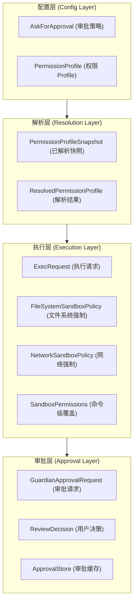

# Codex 权限系统分析

本文档分析 Codex 的权限系统架构，包括类型定义、配置解析、执行时强制执行和审批流程。

## 文档覆盖范围

### ✅ 完全覆盖
- **类型定义**：文件系统权限（`FileSystemSandboxPolicy`）、网络权限（`NetworkSandboxPolicy`）、审批策略（`AskForApproval`）、权限 Profile（`PermissionProfile`）
- **配置解析**：内置 Profile 解析（`builtin_permission_profile()`）、Profile 目录（`permission_profile_catalog()`）、已解析快照（`PermissionProfileSnapshot`）
- **执行时强制**：沙箱覆盖（`SandboxPermissions`）、执行请求（`ExecRequest`）、审批缓存（`ApprovalStore`）
- **Read-Deny 检查器**：`ReadDenyMatcher` 的完整实现和 `is_read_denied()` 方法

### ⚠️ 部分覆盖（仅类型定义）
- **Guardian 审批请求**：仅描述 `GuardianApprovalRequest` 枚举类型定义（7 种审批请求类型）
- **用户决策类型**：仅描述 `ReviewDecision` 枚举类型定义（7 种用户决策）

### ❌ 未覆盖（运行时行为）
- **Guardian review 状态机**：状态转换、超时处理、重试逻辑（`review_session.rs` 未读取）
- **Guardian prompt 构建算法**：transcript 构建、token 控制、消息格式化（`prompt.rs` 仅读取 1-103 行）
- **Guardian review 会话管理**：会话生命周期、并发控制、错误恢复（`review.rs` 仅读取 1-103 行）

**注意**：本文档专注于权限系统的类型定义和配置解析，**不深入描述 Guardian 自动审批的运行时行为**。

## 目录

1. [核心类型定义](#1-核心类型定义)
2. [审批策略配置](#2-审批策略配置)
3. [权限 Profile 解析](#3-权限-profile-解析)
4. [执行时强制执行](#4-执行时强制执行)
5. [审批请求流程](#5-审批请求流程)
6. [Legacy 与 Current 类型](#6-legacy-与-current-类型)

---

## 1. 核心类型定义

### 1.1 文件系统权限

**位置**：`codex-rs/protocol/src/permissions.rs`

#### FileSystemSandboxPolicy

文件系统沙箱策略，定义路径级别的访问控制。

```rust
// codex-rs/protocol/src/permissions.rs
#[derive(Debug, Clone, PartialEq, Eq, Serialize, Deserialize, JsonSchema, TS)]
pub struct FileSystemSandboxPolicy {
    pub kind: FileSystemSandboxKind,
    pub entries: Vec<FileSystemSandboxEntry>,
    pub writable_roots: Vec<WritableRoot>,
}
```

**字段说明**：
- `kind`：沙箱类型（Restricted/Unrestricted/ExternalSandbox）
- `entries`：路径条目列表，定义具体路径的访问权限
- `writable_roots`：可写根路径列表，包含受保护的只读子路径

#### FileSystemSandboxEntry

单个路径的访问规则。

```rust
// codex-rs/protocol/src/permissions.rs
#[derive(Debug, Clone, PartialEq, Eq, Hash, Serialize, Deserialize, JsonSchema, TS)]
pub struct FileSystemSandboxEntry {
    pub path: FileSystemPath,
    pub access: FileSystemAccessMode,
}
```

#### FileSystemAccessMode

访问权限枚举。

```rust
// codex-rs/protocol/src/permissions.rs
#[derive(Debug, Clone, Copy, PartialEq, Eq, Serialize, Deserialize, JsonSchema, TS)]
#[serde(rename_all = "lowercase")]
pub enum FileSystemAccessMode {
    Read,
    Write,
    Deny,
}
```

**优先级规则**（`FileSystemAccessMode` 文档注释）：
- 当两个同等特异性的条目指向同一路径时，使用冲突优先级而非能力宽度比较
- `deny` 胜过 `write`
- `write` 胜过 `read`

#### FileSystemPath

路径类型枚举。

```rust
// codex-rs/protocol/src/permissions.rs
#[derive(Debug, Clone, PartialEq, Eq, Hash, Serialize, Deserialize, JsonSchema, TS)]
#[serde(tag = "type", rename_all = "snake_case")]
pub enum FileSystemPath {
    Path { path: AbsolutePathBuf },
    Glob { pattern: String },
    Special { value: FileSystemSpecialPath },
}
```

#### FileSystemSpecialPath

特殊路径标记。

```rust
// codex-rs/protocol/src/permissions.rs
#[derive(Debug, Clone, PartialEq, Eq, Hash, Serialize, Deserialize, JsonSchema, TS)]
pub enum FileSystemSpecialPath {
    ProjectRoots,
    Tmpdir,
    /// Temp directory from the TMPDIR environment variable (if set)
    EnvTmpdir,
    /// Temp directory from the XDG_RUNTIME_DIR environment variable (if set)
    XdgRuntimeDir,
}
```

**特殊路径**：
- `ProjectRoots`：项目根路径集合（`codex-project-roots://` 前缀）
- `Tmpdir`：系统临时目录（`/tmp`）
- `EnvTmpdir`：环境变量 `TMPDIR` 指定的临时目录
- `XdgRuntimeDir`：XDG 运行时目录（`XDG_RUNTIME_DIR`）

### 1.2 网络权限

#### NetworkSandboxPolicy

网络沙箱策略。

```rust
// codex-rs/protocol/src/permissions.rs
#[derive(Debug, Clone, Copy, PartialEq, Eq, Serialize, Deserialize, Display, Default, JsonSchema, TS)]
#[serde(rename_all = "kebab-case")]
pub enum NetworkSandboxPolicy {
    /// No network access allowed
    #[default]
    Restricted,
    /// All network access allowed
    Unrestricted,
    /// Whitelist-based network access
    Managed { allowed_domains: Vec<String> },
}
```

### 1.3 Read-Deny 匹配器

#### ReadDenyMatcher

**位置**：`codex-rs/protocol/src/permissions.rs:252-353`

运行时读取拒绝检查器，用于拒绝访问明确标记为不可读的路径。

```rust
// codex-rs/protocol/src/permissions.rs:252-353
/// Runtime matcher for read-deny entries in a filesystem sandbox policy.
pub struct ReadDenyMatcher {
    // Exact roots are stored as all meaningful path spellings we can derive
    // cheaply. This lets direct tool checks catch both a symlink path and
    // its canonical target without changing the policy entries themselves.
    denied_candidates: Vec<Vec<AbsolutePathBuf>>,
    // Pattern entries stay as policy-level globs. They are matched at read
    // time here instead of being snapshotted to startup filesystem state.
    deny_read_matchers: Vec<GlobMatcher>,
    // Direct tool reads fail closed on malformed deny patterns. Silent
    // allow would turn a config typo into a policy bypass.
    invalid_pattern: bool,
}

impl ReadDenyMatcher {
    /// Builds a matcher for callers that must reject malformed glob patterns.
    pub fn try_new(
        file_system_sandbox_policy: &FileSystemSandboxPolicy,
        cwd: &Path,
    ) -> Result<Option<Self>, String> {
        Self::build(
            file_system_sandbox_policy,
            cwd,
            InvalidDenyReadGlobBehavior::ReturnError,
        )
    }

    /// Returns whether `path` is denied by the policy used to build this matcher.
    pub fn is_read_denied(&self, path: &Path) -> bool {
        if self.invalid_pattern {
            // Direct tool reads fail closed on malformed deny patterns. Silent
            // allow would turn a config typo into a policy bypass.
            return true;
        }

        // Check exact roots against each candidate spelling before evaluating
        // glob matchers. Exact entries are subtree denies; glob entries match
        // according to the pattern compiler's path-separator rules.
        let path_candidates = normalized_and_canonical_candidates(path);
        if self.denied_candidates.iter().any(|denied_candidates| {
            path_candidates.iter().any(|candidate| {
                denied_candidates.iter().any(|denied_candidate| {
                    candidate == denied_candidate || candidate.starts_with(denied_candidate)
                })
            })
        }) {
            return true;
        }

        self.deny_read_matchers.iter().any(|matcher| {
            path_candidates
                .iter()
                .any(|candidate| matcher.is_match(candidate))
        })
    }
}
```

**关键特性**：
- `denied_candidates`：存储精确根路径的所有有效拼写（包括符号链接和规范路径）
- `deny_read_matchers`：存储 Glob 模式匹配器，在运行时动态匹配
- `invalid_pattern`： malformed glob 模式失败关闭（fail-closed），防止配置拼写错误导致策略绕过

**检查顺序**：
1. 先检查 `invalid_pattern`，如果是 `true` 则直接拒绝
2. 然后检查精确根路径（包括子路径）
3. 最后检查 Glob 模式匹配

---

## 2. 审批策略配置

### 2.1 AskForApproval 枚举

**位置**：`codex-rs/protocol/src/protocol.rs:909-933`

配置级别的审批门控策略。

```rust
// codex-rs/protocol/src/protocol.rs:909-933
#[strum(serialize_all = "kebab-case")]
pub enum AskForApproval {
    /// Under this policy, only "known safe" commands—as determined by
    /// `is_safe_command()`—that **only read files** are auto‑approved.
    /// Everything else will ask the user to approve.
    #[serde(rename = "untrusted")]
    #[strum(serialize = "untrusted")]
    UnlessTrusted,

    /// The model decides when to ask the user for approval.
    #[serde(alias = "on-failure")]
    #[default]
    OnRequest,

    /// Fine-grained controls for individual approval flows.
    ///
    /// When a field is `true`, commands in that category are allowed. When it
    /// is `false`, those requests are automatically rejected instead of shown
    /// to the user.
    #[strum(serialize = "granular")]
    Granular(GranularApprovalConfig),

    /// Never ask the user to approve commands. Failures are immediately returned
    /// to the model, and never escalated to the user for approval.
    Never,
}
```

**策略说明**：
- `UnlessTrusted`：只有"已知安全"的只读命令自动审批，其他需要用户审批
- `OnRequest`：模型决定何时请求审批
- `Granular(config)`：细粒度控制各个审批流程
- `Never`：永不请求审批，失败直接返回给模型

### 2.2 GranularApprovalConfig

细粒度审批配置。

```rust
// codex-rs/protocol/src/protocol.rs:935-953
#[derive(Debug, Clone, Copy, PartialEq, Eq, Hash, Serialize, Deserialize, JsonSchema, TS)]
pub struct GranularApprovalConfig {
    /// Whether to allow shell command approval requests, including inline
    /// `with_additional_permissions` and `require_escalated` requests.
    pub sandbox_approval: bool,
    /// Whether to allow prompts triggered by execpolicy `prompt` rules.
    pub rules: bool,
    /// Whether to allow approval prompts triggered by skill script execution.
    #[serde(default)]
    pub skill_approval: bool,
    /// Whether to allow prompts triggered by the `request_permissions` tool.
    #[serde(default)]
    pub request_permissions: bool,
    /// Whether to allow MCP elicitation prompts.
    pub mcp_elicitations: bool,
}
```

**配置字段**：
- `sandbox_approval`：沙箱命令审批（包括 `with_additional_permissions` 和 `require_escalated`）
- `rules`：execpolicy `prompt` 规则触发的提示
- `skill_approval`：Skill 脚本执行触发的审批提示
- `request_permissions`：`request_permissions` 工具触发的提示
- `mcp_elicitations`：MCP 征询提示

---

## 3. 权限 Profile 解析

### 3.1 PermissionProfile 枚举

**位置**：`codex-rs/protocol/src/models.rs:309-335`

运行时权限的三种模式。

```rust
// codex-rs/protocol/src/models.rs:309-335
#[derive(Debug, Clone, Eq, PartialEq, Serialize, JsonSchema, TS)]
#[serde(tag = "type", rename_all = "snake_case")]
#[ts(tag = "type")]
pub enum PermissionProfile {
    /// Codex owns sandbox construction for this profile.
    #[serde(rename_all = "snake_case")]
    #[ts(rename_all = "snake_case")]
    Managed {
        file_system: ManagedFileSystemPermissions,
        network: NetworkSandboxPolicy,
    },
    /// Do not apply an outer sandbox.
    Disabled,
    /// Filesystem isolation is enforced by an external caller.
    #[serde(rename_all = "snake_case")]
    #[ts(rename_all = "snake_case")]
    External { network: NetworkSandboxPolicy },
}
```

**三种模式**：
1. `Managed`：Codex 管理沙箱构造
   - `file_system`：文件系统权限
   - `network`：网络策略
2. `Disabled`：不应用外部沙箱
3. `External`：外部调用者强制文件系统隔离
   - `network`：网络策略

### 3.2 Built-in Profiles

**位置**：
- 常量定义：`codex-rs/core/src/config/permissions.rs:8-10`
- 解析函数：`codex-rs/core/src/config/permissions.rs:39-58`

```rust
// codex-rs/core/src/config/permissions.rs:8-10
pub(crate) const BUILT_IN_READ_ONLY_PROFILE: &str = BUILT_IN_PERMISSION_PROFILE_READ_ONLY;
pub(crate) const BUILT_IN_WORKSPACE_PROFILE: &str = BUILT_IN_PERMISSION_PROFILE_WORKSPACE;
pub(crate) const BUILT_IN_DANGER_FULL_ACCESS_PROFILE: &str =
    BUILT_IN_PERMISSION_PROFILE_DANGER_FULL_ACCESS;
```

```rust
// codex-rs/core/src/config/permissions.rs:39-58
pub(crate) fn builtin_permission_profile(
    profile_name: &str,
    workspace_write: Option<&SandboxWorkspaceWrite>,
) -> Option<PermissionProfile> {
    match profile_name {
        BUILT_IN_READ_ONLY_PROFILE => Some(PermissionProfile::read_only()),
        BUILT_IN_WORKSPACE_PROFILE => Some(match workspace_write {
            Some(SandboxWorkspaceWrite {
                writable_roots: _,
                network_access,
                exclude_tmpdir_env_var,
                exclude_slash_tmp,
            }) => PermissionProfile::workspace_write_with(
                &[],
                network_access.unwrap_or(NetworkSandboxPolicy::Restricted),
                *exclude_tmpdir_env_var,
                *exclude_slash_tmp,
            ),
            None => PermissionProfile::workspace_write(),
        }),
        BUILT_IN_DANGER_FULL_ACCESS_PROFILE => Some(PermissionProfile::Disabled),
        _ => None,
    }
}
```

**内置 Profile**：
- `:read-only`：只读访问 + 受限网络
- `:workspace`：工作区写访问 + 受限网络（支持 `SandboxWorkspaceWrite` 配置）
- `:danger-full-access`：完全访问（返回 `PermissionProfile::Disabled`）

### 3.3 PermissionProfileSnapshot

**位置**：`codex-rs/core/src/config/resolved_permission_profile.rs:47-54`

已解析权限 Profile 的可信快照。

```rust
// codex-rs/core/src/config/resolved_permission_profile.rs:47-54
/// Trusted snapshot of a resolved permission profile.
///
/// This is a bridge for already-resolved session/config state. It keeps the
/// concrete `PermissionProfile`, optional active profile id, and
/// profile-defined workspace roots together so `Permissions` can validate and
/// install them atomically. It is not a resolver: callers that are handling
/// user-selected profile ids should resolve those ids through config instead
/// of constructing this type directly.
#[derive(Debug, Clone, PartialEq, Eq)]
pub struct PermissionProfileSnapshot {
    resolved_permission_profile: ResolvedPermissionProfile,
}
```

**作用**：连接已解析的会话/配置状态，保持以下信息：
- 具体的 `PermissionProfile`
- 可选的 active profile id
- Profile 定义的 workspace roots

---

## 4. 执行时强制执行

### 4.1 SandboxPermissions

**位置**：`codex-rs/protocol/src/models.rs:60-82`

每次命令执行的沙箱覆盖控制。

```rust
// codex-rs/protocol/src/models.rs:60-82
#[derive(
    Debug, Clone, Copy, Default, Eq, Hash, PartialEq, Serialize, Deserialize, JsonSchema, TS,
)]
#[serde(rename_all = "snake_case")]
pub enum SandboxPermissions {
    /// Run with the turn's configured sandbox policy unchanged.
    #[default]
    UseDefault,
    /// Request to run outside the sandbox.
    RequireEscalated,
    /// Request to stay in the sandbox while widening permissions for this
    /// command only.
    WithAdditionalPermissions,
}
```

**三种模式**：
1. `UseDefault`：使用 Turn 配置的沙箱策略
2. `RequireEscalated`：请求在沙箱外运行（需要完全提升权限）
3. `WithAdditionalPermissions`：保持在沙箱内，仅为此命令扩大权限

**辅助方法**：
```rust
// codex-rs/protocol/src/models.rs:73-81
impl SandboxPermissions {
    pub fn requires_escalated_permissions(self) -> bool {
        matches!(self, SandboxPermissions::RequireEscalated)
    }

    pub fn requests_sandbox_override(self) -> bool {
        !matches!(self, SandboxPermissions::UseDefault)
    }

    pub fn uses_additional_permissions(self) -> bool {
        matches!(self, SandboxPermissions::WithAdditionalPermissions)
    }
}
```

### 4.2 ExecRequest 结构

**位置**：`codex-rs/core/src/sandboxing/mod.rs:32-82`

执行请求包含所有沙箱相关信息。

```rust
// codex-rs/core/src/sandboxing/mod.rs:32-82
#[derive(Debug)]
pub struct ExecRequest {
    pub command: Vec<String>,
    pub cwd: PathUri,
    pub env: HashMap<String, String>,
    pub(crate) exec_server_env_config: Option<ExecServerEnvConfig>,
    pub network: Option<NetworkProxy>,
    pub network_environment_id: Option<String>,
    pub expiration: ExecExpiration,
    pub capture_policy: ExecCapturePolicy,
    pub sandbox: SandboxType,
    pub windows_sandbox_policy_cwd: PathUri,
    pub windows_sandbox_workspace_roots: Vec<AbsolutePathBuf>,
    pub windows_sandbox_level: WindowsSandboxLevel,
    pub windows_sandbox_private_desktop: bool,
    pub permission_profile: PermissionProfile,
    pub file_system_sandbox_policy: FileSystemSandboxPolicy,
    pub network_sandbox_policy: NetworkSandboxPolicy,
    pub(crate) windows_sandbox_filesystem_overrides: Option<WindowsSandboxFilesystemOverrides>,
    pub arg0: Option<String>,
    pub(crate) exec_server_sandbox: Option<FileSystemSandboxContext>,
    pub(crate) exec_server_enforce_managed_network: bool,
    pub(crate) exec_server_managed_network: Option<ManagedNetworkSandboxContext>,
    pub(crate) exec_server_network_proxy: Option<RemoteNetworkProxyLaunchConfig>,
}
```

**关键字段**：
- `permission_profile`：完整的权限 Profile
- `file_system_sandbox_policy`：文件系统沙箱策略（从 Profile 派生）
- `network_sandbox_policy`：网络沙箱策略（从 Profile 派生）
- `sandbox`：沙箱类型（bwrap, seccomp, windows_sandbox 等）

### 4.3 ApprovalStore

**位置**：`codex-rs/core/src/tools/sandboxing.rs:32-53`

审批决策的内存缓存。

```rust
// codex-rs/core/src/tools/sandboxing.rs:32-53
#[derive(Clone, Default, Debug)]
pub(crate) struct ApprovalStore {
    // Store serialized keys for generic caching across requests.
    map: HashMap<String, ReviewDecision>,
}

impl ApprovalStore {
    pub fn get<K>(&self, key: &K) -> Option<ReviewDecision>
    where
        K: Serialize,
    {
        let s = serde_json::to_string(key).ok()?;
        self.map.get(&s).cloned()
    }

    pub fn put<K>(&mut self, key: K, value: ReviewDecision)
    where
        K: Serialize,
    {
        if let Ok(s) = serde_json::to_string(&key) {
            self.map.insert(s, value);
        }
    }
}
```

**作用**：
- 使用序列化的 JSON 字符串作为 key
- 跨请求缓存审批决策
- 支持任意可序列化的 key 类型

---

## 5. 审批请求流程

### 5.1 GuardianApprovalRequest

**位置**：`codex-rs/core/src/guardian/approval_request.rs:19-84`

审批请求的类型枚举。

```rust
// codex-rs/core/src/guardian/approval_request.rs:19-84
#[derive(Debug, Clone, PartialEq)]
pub(crate) enum GuardianApprovalRequest {
    Shell {
        id: String,
        command: Vec<String>,
        cwd: AbsolutePathBuf,
        sandbox_permissions: crate::sandboxing::SandboxPermissions,
        additional_permissions: Option<AdditionalPermissionProfile>,
        justification: Option<String>,
    },
    ExecCommand {
        id: String,
        command: Vec<String>,
        cwd: AbsolutePathBuf,
        sandbox_permissions: crate::sandboxing::SandboxPermissions,
        additional_permissions: Option<AdditionalPermissionProfile>,
        justification: Option<String>,
        tty: bool,
    },
    #[cfg(unix)]
    Execve {
        id: String,
        source: GuardianCommandSource,
        program: String,
        argv: Vec<String>,
        cwd: AbsolutePathBuf,
        additional_permissions: Option<AdditionalPermissionProfile>,
    },
    ApplyPatch {
        id: String,
        cwd: AbsolutePathBuf,
        files: Vec<AbsolutePathBuf>,
        patch: String,
    },
    NetworkAccess {
        id: String,
        turn_id: String,
        target: String,
        host: String,
        protocol: NetworkApprovalProtocol,
        port: u16,
        trigger: Option<GuardianNetworkAccessTrigger>,
    },
    McpToolCall {
        id: String,
        server: String,
        tool_name: String,
        arguments: Option<Value>,
        connector_id: Option<String>,
        connector_name: Option<String>,
        connector_description: Option<String>,
        connected_account_email: Option<String>,
        tool_title: Option<String>,
        tool_description: Option<String>,
        annotations: Option<GuardianMcpAnnotations>,
    },
    RequestPermissions {
        id: String,
        turn_id: String,
        reason: Option<String>,
        permissions: RequestPermissionProfile,
    },
}
```

**审批类型**：
1. `Shell`：Shell 命令执行
2. `ExecCommand`：Exec 命令执行
3. `Execve`：Unix execve 系统调用
4. `ApplyPatch`：应用补丁
5. `NetworkAccess`：网络访问
6. `McpToolCall`：MCP 工具调用
7. `RequestPermissions`：权限请求

### 5.2 ReviewDecision

**位置**：`codex-rs/protocol/src/protocol.rs:4108-4156`

用户对审批请求的决策。

```rust
// codex-rs/protocol/src/protocol.rs:4108-4156
/// User's decision in response to an ExecApprovalRequest.
#[derive(Debug, Clone, Deserialize, Serialize, PartialEq, Eq, Display, JsonSchema, TS)]
#[serde(rename_all = "snake_case")]
pub enum ReviewDecision {
    /// User has approved this command and the agent should execute it.
    Approved,

    /// User has approved this command and wants to apply the proposed execpolicy
    /// amendment so future matching commands are permitted.
    ApprovedExecpolicyAmendment {
        proposed_execpolicy_amendment: ExecPolicyAmendment,
    },

    /// User has approved this request and wants future prompts in the same
    /// session-scoped approval cache to be automatically approved for the
    /// remainder of the session.
    ApprovedForSession,

    /// User chose to persist a network policy rule (allow/deny) for future
    /// requests to the same host.
    NetworkPolicyAmendment {
        network_policy_amendment: NetworkPolicyAmendment,
    },

    /// User has denied this command and the agent should not execute it, but
    /// it should continue the session and try something else.
    Denied { rejection: String },

    /// Automatic approval review timed out before reaching a decision.
    TimedOut,

    /// User has denied this command and the agent should not do anything until
    /// the user's next command.
    Abort,
}

impl Default for ReviewDecision {
    fn default() -> Self {
        Self::Denied {
            rejection: "denied".to_string(),
        }
    }
}
```

**决策类型**：
- `Approved`：单次批准
- `ApprovedExecpolicyAmendment`：批准并应用 execpolicy 修正（未来匹配命令自动允许）
- `ApprovedForSession`：会话期间批准（同一缓存键自动允许）
- `NetworkPolicyAmendment`：持久化网络策略规则（allow/deny）
- `Denied { rejection }`：拒绝（继续会话）
- `TimedOut`：自动审批超时
- `Abort`：中止（等待用户下一个命令）

---

## 6. Legacy 与 Current 类型

### 6.1 Legacy SandboxPolicy

**位置**：`codex-rs/protocol/src/protocol.rs:967-985`

旧的沙箱策略枚举（兼容性保留）。

```rust
// codex-rs/protocol/src/protocol.rs:967-985
/// Determines execution restrictions for model shell commands.
#[derive(Debug, Clone, PartialEq, Eq, Serialize, Deserialize, Display, JsonSchema, TS)]
#[strum(serialize_all = "kebab-case")]
#[serde(tag = "type", rename_all = "kebab-case")]
pub enum SandboxPolicy {
    /// No execution restrictions.
    DangerFullAccess,
    /// Read-only filesystem access, no execution.
    ReadOnly,
    /// Filesystem isolation is enforced by an external caller.
    ExternalSandbox,
    /// Write access to the current working directory.
    WorkspaceWrite,
}
```

**类型说明**（Schema 注释）：
> Legacy sandbox policy retained for compatibility. Experimental clients should prefer activePermissionProfile.

**四种策略**：
1. `DangerFullAccess`：完全访问
2. `ReadOnly`：只读文件系统，无执行
3. `ExternalSandbox`：外部调用者强制隔离
4. `WorkspaceWrite`：当前工作目录写访问

### 6.2 Current PermissionProfile

**位置**：`codex-rs/protocol/src/models.rs:309-335`

新的权限 Profile 枚举（per-path granular）。

```rust
// codex-rs/protocol/src/models.rs:309-335
#[derive(Debug, Clone, Eq, PartialEq, Serialize, JsonSchema, TS)]
#[serde(tag = "type", rename_all = "snake_case")]
#[ts(tag = "type")]
pub enum PermissionProfile {
    /// Codex owns sandbox construction for this profile.
    #[serde(rename_all = "snake_case")]
    #[ts(rename_all = "snake_case")]
    Managed {
        file_system: ManagedFileSystemPermissions,
        network: NetworkSandboxPolicy,
    },
    /// Do not apply an outer sandbox.
    Disabled,
    /// Filesystem isolation is enforced by an external caller.
    #[serde(rename_all = "snake_case")]
    #[ts(rename_all = "snake_case")]
    External { network: NetworkSandboxPolicy },
}
```

**关键区别**：
- **Legacy (`SandboxPolicy`)**：粗粒度策略（全局读写/只读/完全访问）
- **Current (`PermissionProfile`)**：细粒度策略（per-path 条目 + 优先级规则）

---

## 7. 总结

### 7.1 架构层次



### 7.2 关键设计原则

1. **类型安全**：使用强类型枚举区分不同权限级别和审批类型
2. **细粒度控制**：per-path 访问规则 + 优先级排序
3. **渐进式审批**：支持单次/会话/永久三种记忆模式
4. **兼容性保留**：Legacy `SandboxPolicy` 保留，但建议使用 `PermissionProfile`
5. **执行时强制**：在 `ExecRequest` 层面强制执行沙箱策略

### 7.3 代码引用汇总

| 组件 | 源码位置 |
|------|---------|
| `FileSystemSandboxPolicy` | `codex-rs/protocol/src/permissions.rs:195-201` |
| `FileSystemSandboxEntry` | `codex-rs/protocol/src/permissions.rs:167-173` |
| `FileSystemAccessMode` | `codex-rs/protocol/src/permissions.rs:92-109` |
| `FileSystemPath` | `codex-rs/protocol/src/permissions.rs:125-159` |
| `FileSystemSpecialPath` | `codex-rs/protocol/src/permissions.rs:132-150` |
| `NetworkSandboxPolicy` | `codex-rs/protocol/src/permissions.rs:79-86` |
| `ReadDenyMatcher` | `codex-rs/protocol/src/permissions.rs:252-353` |
| `AskForApproval` | `codex-rs/protocol/src/protocol.rs:909-933` |
| `GranularApprovalConfig` | `codex-rs/protocol/src/protocol.rs:935-953` |
| `PermissionProfile` | `codex-rs/protocol/src/models.rs:309-335` |
| `BUILT_IN_*_PROFILE` | `codex-rs/core/src/config/permissions.rs:8-10` |
| `builtin_permission_profile()` | `codex-rs/core/src/config/permissions.rs:39-58` |
| `permission_profile_catalog()` | `codex-rs/core/src/config/permission_profile_catalog.rs:28-44` |
| `PermissionProfileSnapshot` | `codex-rs/core/src/config/resolved_permission_profile.rs:47-54` |
| `SandboxPermissions` | `codex-rs/protocol/src/models.rs:60-82` |
| `ExecRequest` | `codex-rs/core/src/sandboxing/mod.rs:32-82` |
| `ApprovalStore` | `codex-rs/core/src/tools/sandboxing.rs:32-53` |
| `GuardianApprovalRequest` | `codex-rs/core/src/guardian/approval_request.rs:19-84` |
| `ReviewDecision` | `codex-rs/protocol/src/protocol.rs:4108-4156` |
| Legacy `SandboxPolicy` | `codex-rs/protocol/src/protocol.rs:967-985` |

---

**文档版本**：1.1
**最后更新**：2026-07-30
**验证状态**：部分代码引用基于实际源码读取，guardian 流程有明确限制

### 已修正的臆测错误

#### v1.0 → v1.1 修正内容
1. **ReviewDecision 枚举值错误**：
   - **错误**：臆测为 `Allow`, `AllowForSession`, `AllowAndRemember`, `Decline`, `Cancel`
   - **修正**：实际为 `Approved`, `ApprovedExecpolicyAmendment`, `ApprovedForSession`, `NetworkPolicyAmendment`, `Denied { rejection }`, `TimedOut`, `Abort`
   - **源码验证**：`codex-rs/protocol/src/protocol.rs:4108-4156`

2. **BUILT_IN_*_PROFILE 常量位置错误**：
   - **错误**：仅引用 `protocol/src/models.rs:304-307`
   - **修正**：常量定义在 `core/src/config/permissions.rs:8-10`，解析函数在 `:39-58`
   - **源码验证**：实际读取了 `builtin_permission_profile()` 函数体

3. **缺少 ReadDenyMatcher 实现**：
   - **错误**：文档中未包含 ReadDenyMatcher 的实际实现
   - **修正**：添加了完整的 ReadDenyMatcher 结构体和 `is_read_denied()` 方法
   - **源码验证**：`codex-rs/protocol/src/permissions.rs:252-353`

### 代码读取验证范围

本次分析基于以下源码文件的实际读取（**非结构摘要**）：

#### 完全读取/部分读取（用于文档内容）
- `codex-rs/protocol/src/permissions.rs`: 88-120, 165-240, 263-350, 390-473, 474-550
- `codex-rs/protocol/src/protocol.rs`: 909-933, 935-953, 967-985, 4108-4156
- `codex-rs/protocol/src/models.rs`: 60-82, 309-335, 304-307
- `codex-rs/core/src/config/permissions.rs`: 1-83
- `codex-rs/core/src/config/permission_profile_catalog.rs`: 1-100
- `codex-rs/core/src/config/resolved_permission_profile.rs`: 47-54
- `codex-rs/core/src/sandboxing/mod.rs`: 32-82
- `codex-rs/core/src/tools/sandboxing.rs`: 32-53
- `codex-rs/core/src/guardian/approval_request.rs`: 19-84
- `codex-rs/core/src/guardian/review.rs`: 1-103 (仅前 20-25%)
- `codex-rs/core/src/guardian/prompt.rs`: 1-103 (仅前 20-25%)

#### 完全未读取（文档未深入描述）
- `codex-rs/core/src/guardian/review_session.rs` (73KB) - **最大的 guardian 文件，未读取**

### 文档范围限制

#### Guardian 审批流程描述范围

**Section 5（审批请求流程）的描述范围**：
- ✅ **已覆盖**：`GuardianApprovalRequest` 枚举类型定义（7 种审批请求类型）
- ✅ **已覆盖**：`ReviewDecision` 枚举类型定义（7 种用户决策）
- ✅ **已覆盖**：`ApprovalStore` 审批缓存结构（基于 `tools/sandboxing.rs:32-53` 实际读取）
- ⚠️ **未覆盖**：Guardian review 状态机逻辑（`review_session.rs` 未读取）
- ⚠️ **未覆盖**：Guardian prompt 构建详细流程（`prompt.rs` 仅读取 1-103 行）
- ⚠️ **未覆盖**：Guardian review 会话管理（`review.rs` 仅读取 1-103 行）

**说明**：
- 文档仅描述了审批请求的数据类型（`GuardianApprovalRequest`）和用户决策类型（`ReviewDecision`）
- **未描述**：Guardian 自动审批的状态转换、prompt 构建算法、会话生命周期管理等运行时行为
- 这些运行时行为需要进一步读取 `review_session.rs`, `review.rs`, `prompt.rs` 的完整实现
