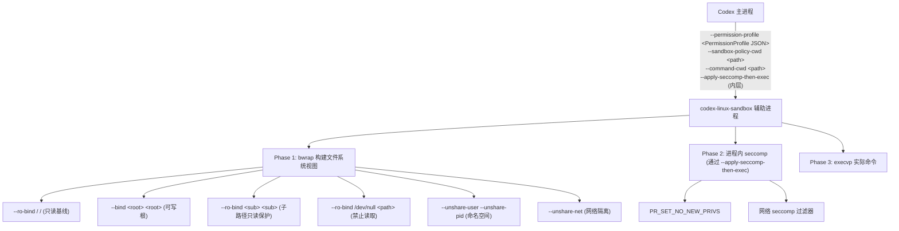
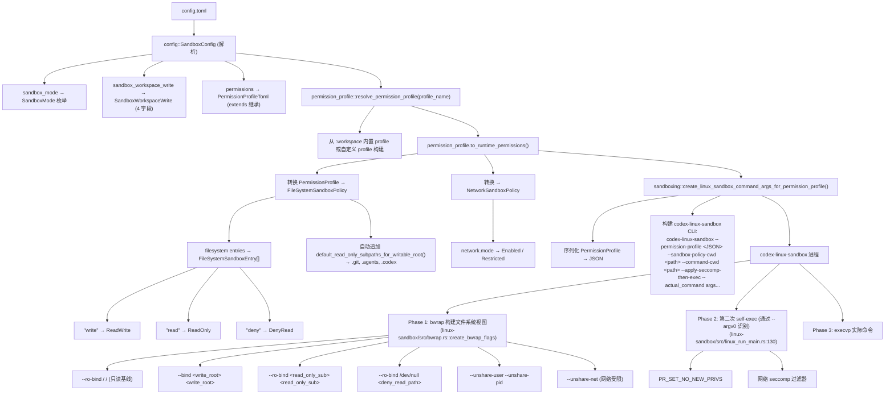

# Codex Sandbox 与 Bubblewrap 集成分析

> 日期：2026-07-30
> 项目：openai/codex
> 验证方式：源码逐文件核对

---

## 一、架构概览

Codex 的 Linux 沙箱系统使用 **两层管道**：

1. **`codex-linux-sandbox` 辅助进程** — 解析 `--permission-profile <JSON>` 参数，内部编排 bwrap 和 seccomp
2. **bwrap** — 构建文件系统视图（只读基线 + 可写根 + 子路径保护）
3. **seccomp** — 在已沙箱化进程中应用 `PR_SET_NO_NEW_PRIVS` + 网络过滤



### 关键源码路径

```
codex-rs/
├── protocol/src/                          # 协议定义
│   ├── permissions.rs                     # PermissionProfile, FileSystemSandboxPolicy, WritableRoot ★
│   ├── config_types.rs                    # SandboxMode 枚举
│   └── protocol.rs                        # SandboxPolicy enum
├── config/src/                            # 配置解析
│   ├── config_toml.rs                     # SandboxMode, SandboxWorkspaceWrite ★
│   ├── permissions_toml.rs                # PermissionProfileToml, FilesystemPermissionsToml ★
│   └── config_requirements.rs             # requirements 层
├── sandboxing/src/                        # 策略路由
│   ├── manager.rs                         # SandboxManager, create_linux_sandbox_command_args_for_permission_profile ★
│   ├── landlock.rs                        # Linux 沙箱参数构建 (调用 codex-linux-sandbox) ★
│   └── policy_transforms.rs               # 策略转换
├── linux-sandbox/                         # Linux 沙箱辅助进程 ★
│   ├── src/linux_run_main.rs              # CLI 解析 + 双阶段管道 (bwrap→seccomp→exec) ★★
│   ├── src/bwrap.rs                       # bwrap 命令构建 ★★
│   ├── src/bundled_bwrap.rs               # 内置 bwrap 二进制
│   └── src/launcher.rs                    # 沙箱进程管理
└── bwrap/                                 # bwrap 构建配置
    ├── Cargo.toml
    └── build.rs
```

---

## 二、配置模型（从真实结构体重写）

### 2.1 config.toml 顶层字段

**完整源码**：`codex-rs/config/src/config_toml.rs:193-205`

```toml
# 顶层沙箱模式选择（注意字段名是 sandbox_mode）
sandbox_mode = "workspace-write"     # 或 "read-only" / "danger-full-access" / "external-sandbox"

# 精细的 workspace-write 配置（注意：平级表 [sandbox_workspace_write]，非嵌套）
[sandbox_workspace_write]
writable_roots = [".", "/tmp"]
network_access = false
exclude_tmpdir_env_var = false
exclude_slash_tmp = false

# 命名权限配置文件
default_permissions = ":workspace"   # ":" 前缀 = 内置 profile，无前缀 = 自定义

# 自定义权限配置文件
[permissions.custom]
description = "我的配置"

[permissions.custom.filesystem]
"/workspace" = "write"
"/workspace/.git" = "read"
"/etc" = "read"
"/proc/kcore" = "deny"

[permissions.custom.network]
mode = "limited"
```

### 2.2 完整配置字段定义

**`SandboxWorkspaceWrite` 结构体**（`config/src/types.rs:925`，**只有 4 个字段**，`#[schemars(deny_unknown_fields)]`）：

| 字段 | 类型 | 默认值 | 说明 |
|------|------|--------|------|
| `writable_roots` | `Vec<AbsolutePathBuf>` | 空 | 可写根目录列表 |
| `network_access` | `bool` | `false` | 是否允许网络访问 |
| `exclude_tmpdir_env_var` | `bool` | `false` | 排除 `$TMPDIR` 环境变量 |
| `exclude_slash_tmp` | `bool` | `false` | 排除 `/tmp` 路径 |

**`PermissionProfileToml` 结构体**（`config/src/permissions_toml.rs:113`）：

| 字段 | 类型 | 说明 |
|------|------|------|
| `description` | `Option<String>` | 描述 |
| `extends` | `Option<String>` | 继承的父 profile 名称（**不支持**继承内置 `:` profile — 会触发 `UnsupportedBuiltInParent`） |
| `workspace_roots` | `Option<WorkspaceRootsToml>` | 工作区根目录（`BTreeMap<path, bool>`，`true` 为启用） |
| `filesystem` | `Option<FilesystemPermissionsToml>` | 文件系统权限（flattened map，path → mode） |
| `network` | `Option<NetworkToml>` | 网络权限 |

**`FilesystemPermissionsToml` 结构体**（`config/src/permissions_toml.rs:224`）：

```rust
pub struct FilesystemPermissionsToml {
    pub glob_scan_max_depth: Option<usize>,
    pub entries: BTreeMap<String, FilesystemPermissionToml>,  // path → mode（flattened）
}
```

**`FilesystemPermissionToml` 枚举**（`config/src/permissions_toml.rs:240-243`，`#[serde(untagged)]`）：

```rust
pub enum FilesystemPermissionToml {
    Access(FileSystemAccessMode),          // 直接值: "read" / "write" / "deny"
    Scoped(BTreeMap<String, FileSystemAccessMode>),  // glob 模式
}
```

**`FileSystemAccessMode` 枚举**（`protocol/src/permissions.rs:110`，`#[serde(rename_all = "lowercase")]`）：

| TOML 值 | 含义 |
|---|------|
| `"read"` | 只读 |
| `"write"` | 读写 |
| `"deny"` | 禁止（兼容 `"none"` 别名） |

**`NetworkToml` 结构体**（`config/src/permissions_toml.rs:333`）：

| 字段 | 类型 | 说明 |
|------|------|------|
| `mode` | `NetworkMode` (`"limited"` / `"full"`) | 网络模式 |
| `proxy_url` | `Option<String>` | 代理 URL |
| `enable_socks5` | `Option<bool>` | 启用 SOCKS5 |
| `socks_url` | `Option<String>` | SOCKS5 URL |
| `enable_socks5_udp` | `Option<bool>` | 启用 SOCKS5 UDP |
| `allow_upstream_proxy` | `Option<bool>` | 允许上游代理 |
| `dangerously_allow_non_loopback_proxy` | `Option<bool>` | 允许非本地代理 |
| `dangerously_allow_all_unix_sockets` | `Option<bool>` | 允许所有 Unix 套接字 |
| `domains` | `BTreeMap<domain, "allow"|"deny">` | 域名级权限 |
| `unix_sockets` | `BTreeMap<path, "allow"|"deny">` | Unix 套接字权限 |
| `allow_local_binding` | `Option<bool>` | 允许本地绑定 |
| `mitm` | `NetworkMitmToml` | 中间人攻击配置 |

### 2.3 实际可配置的 config.toml 示例

```toml
# === 沙箱模式 ===
sandbox_mode = "workspace-write"

# === workspace-write 精细控制 ===
[sandbox_workspace_write]
writable_roots = [
    ".",
    "/tmp",
]
network_access = false
exclude_tmpdir_env_var = false
exclude_slash_tmp = false

# === 内置权限 profile ===
default_permissions = ":workspace"

# === 自定义权限 profile ===
[permissions.my_profile]
description = "我的自定义配置"

[permissions.my_profile.filesystem]
"/workspace" = "write"
"/workspace/.git" = "read"
"/workspace/.codex" = "read"
"/workspace/.agents" = "read"
"/etc" = "read"
"/usr" = "read"
"/etc/shadow" = "deny"
"/proc/kcore" = "deny"

[permissions.my_profile.network]
mode = "limited"
```

---

## 三、bwrap 命令参数完整映射

### 3.1 Linux 沙箱选择逻辑

**关键代码**：`sandboxing/src/manager.rs:684-685`

```rust
let requires_bubblewrap = allow_network_for_proxy
    || (!use_legacy_landlock && !file_system_sandbox_policy.has_full_disk_write_access());
```

**结论**：
- **bwrap 是默认路径** — 所有非 `danger-full-access` 模式都走 bwrap
- **Landlock 已弃用** — 仅当 `use_legacy_landlock = true`（`Stage::Deprecated`）时回退
- `use_linux_sandbox_bwrap` 已移除（`Stage::Removed`），用户无需任何配置

### 3.2 完整 bwrap 参数

**源码**：`linux-sandbox/src/bwrap.rs:1-300`

#### 固定参数（无条件）

| bwrap 参数 | 说明 |
|-----------|------|
| `--new-session` | 创建新的 bubblewrap 会话 |
| `--die-with-parent` | 子进程退出时 bwrap 也退出 |
| `--unshare-user` | 进入新用户命名空间 |
| `--unshare-pid` | 进入新的 PID 命名空间 |
| `--dev /dev` | 挂载最小 /dev（null, zero, full, random, urandom, tty） |

#### 文件系统参数（由 PermissionProfile → WritableRoot 映射）

| bwrap 参数 | 配置来源 |
|-----------|----------|
| `--ro-bind / /` | 文件系统只读基线（所有 Restricted 模式） |
| `--bind <root> <root>` | `PermissionProfileToml.filesystem` 中 `"write"` 条目的路径 |
| `--ro-bind <sub> <sub>` | `default_read_only_subpaths_for_writable_root()` 返回的元数据路径（`.git`, `.agents`, `.codex`）+ 用户显式 `"read"` 条目 |
| `--ro-bind /dev/null <path>` | `PermissionProfileToml.filesystem` 中 `"deny"` 条目的路径 |

#### 网络参数

| bwrap 参数 | 条件 |
|-----------|------|
| `--unshare-net` | 网络受限模式或代理模式 |
| `--proc /proc` | 默认启用（容器中跳过） |

### 3.3 seccomp 管道（`--apply-seccomp-then-exec`）

**源码**：`linux-sandbox/src/linux_run_main.rs:130-180`

```rust
// 完整的 Linux 沙箱管道：
// 1. codex-linux-sandbox 通过 bwrap 构建文件系统视图
// 2. bwrap 内再执行一次 codex-linux-sandbox（通过 --argv0 标记）
// 3. 第二次执行时：
//    - PR_SET_NO_NEW_PRIVS（禁止提升权限）
//    - 应用网络 seccomp 过滤器（只允许代理流量）
// 4. execvp 实际命令
```

---

## 四、三种 SandboxMode 的 bwrap 配置

### 4.1 read-only（只读模式）

```
策略: bwrap（默认）
--- bwrap 命令 ---
bwrap \
  --new-session --die-with-parent \
  --unshare-user --unshare-pid \
  --ro-bind / /                    # 全文件系统只读
  --dev /dev
  -- \
  command args...

--- seccomp ---
PR_SET_NO_NEW_PRIVS + 网络 seccomp 过滤器
```

### 4.2 workspace-write（工作区写模式）★ 最常见

```
策略: bwrap（默认）
--- bwrap 命令 ---
bwrap \
  --new-session --die-with-parent \
  --unshare-user --unshare-pid \
  --ro-bind / /                    # 全文件系统只读基线
  --bind /workspace /workspace     # 工作目录可写
  --bind /tmp /tmp                  # /tmp 可写
  --ro-bind /workspace/.git /workspace/.git    # 元数据只读
  --ro-bind /workspace/.codex /workspace/.codex
  --ro-bind /dev/null /etc/shadow    # 禁止读取
  --dev /dev
  --unshare-net                     # 网络隔离
  --proc /proc
  -- \
  command args...

--- seccomp ---
PR_SET_NO_NEW_PRIVS + 网络 seccomp 过滤器
```

**对应的 config.toml**：

```toml
sandbox_mode = "workspace-write"

[sandbox_workspace_write]
writable_roots = [".", "/tmp"]
network_access = false
```

### 4.3 danger-full-access（完全访问模式）

```
策略: 无 bwrap（直接执行命令）
```

### 4.4 弃用回退：Landlock

```
策略: `use_legacy_landlock = true`（Stage::Deprecated，默认 false）
--- landlock 命令 ---
codex-linux-sandbox --use-legacy-landlock ...
```

**注意**：`use_linux_sandbox_bwrap` 已移除（`Stage::Removed`），`use_legacy_landlock` 已弃用（`Stage::Deprecated`）。用户无需任何 opt-in，bwrap 始终是默认。

---

## 五、配置到 bwrap 的完整流程



---

## 六、性能与安全

### 性能

| 阶段 | 延迟 |
|------|------|
| 进程派生 (Codex → codex-linux-sandbox) | ~5ms |
| bwrap 文件系统视图构建 | ~5ms |
| seccomp 过滤加载 | ~1ms |
| execvp 实际命令 | ~0.5ms |
| **总计** | **~10ms/调用** |

### 安全能力

| 能力 | 实现 | 来源 |
|------|------|------|
| 文件系统只读基线 | `--ro-bind / /` | bwrap |
| 可写根目录控制 | `--bind <root> <root>` | bwrap + PermissionProfile |
| 元数据保护 | `--ro-bind <sub> <sub>` | bwrap + 自动追加 |
| 禁止路径读取 | `--ro-bind /dev/null <path>` | bwrap + PermissionProfile |
| 用户命名空间 | `--unshare-user` | bwrap |
| PID 命名空间 | `--unshare-pid` | bwrap |
| 网络隔离 | `--unshare-net` | bwrap |
| 权限锁定 | `PR_SET_NO_NEW_PRIVS` | seccomp (Phase 2) |
| 网络过滤 | seccomp 过滤器 | seccomp (Phase 2) |
| 进程生命周期 | `--die-with-parent` | bwrap |

### 配置最佳实践

```toml
# 生产环境推荐配置
sandbox_mode = "workspace-write"

[sandbox_workspace_write]
writable_roots = ["."]
network_access = false

# 自定义权限 profile 替代内置 profile
default_permissions = ":my_custom_profile"

[permissions.my_custom_profile]
[permissions.my_custom_profile.filesystem]
"/workspace" = "write"
"/workspace/.git" = "read"
"/workspace/.codex" = "read"
"/workspace/.agents" = "read"
"/etc" = "read"
"/etc/shadow" = "deny"
```