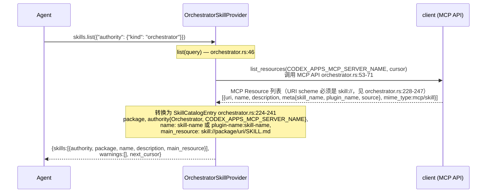
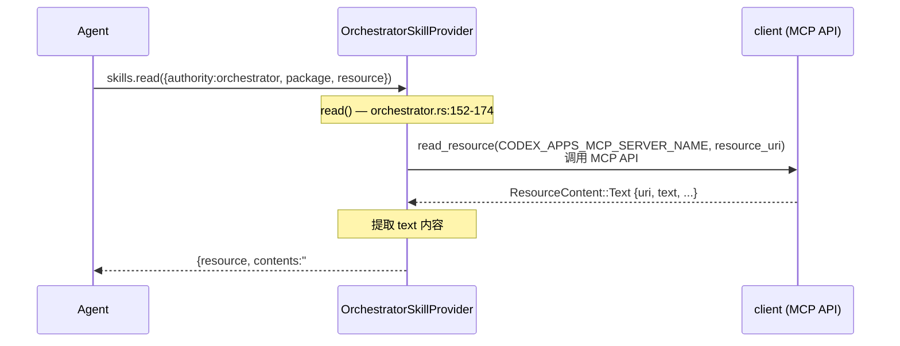
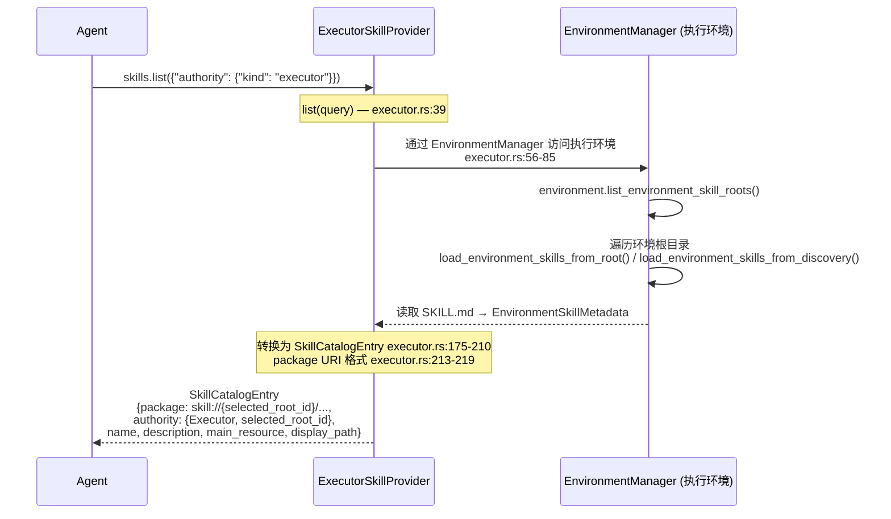
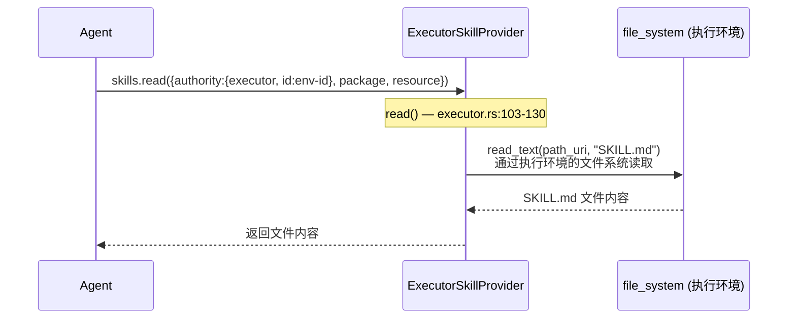
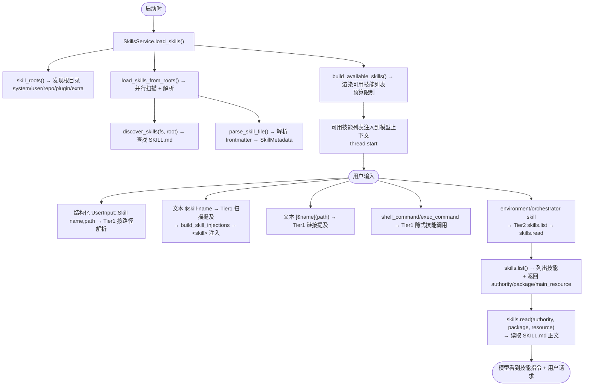

# Codex Skill 系统完整分析

> 日期：2026-07-30
> 项目：openai/codex
> 来源：`codex-rs/skills/`, `codex-rs/core-skills/`, `codex-rs/ext/skills/`

---

## 一、Skill 概念与文件结构

Skill 是**模块化指令集**，用于扩展 Codex 的专业能力。Think of them as "onboarding guides" for specific domains or tasks.

### 两种 Skill 访问层级

| 层级       | 技能来源                                                            | 访问方式                                                                              |
| ---------- | ------------------------------------------------------------------- | ------------------------------------------------------------------------------------- |
| **Tier 1** | 文件系统 skill（`file` locators, `SkillSourceKind::Host`）          | Agent 直接使用 `shell_command`/`exec_command` 打开 SKILL.md 路径。无专用 skill 工具。 |
| **Tier 2** | 环境/编排器 skill（`environment resource`/`orchestrator resource`） | 通过专用 `skills.list` 和 `skills.read` 工具访问。                                    |

### 典型目录结构

```
skill-name/
├── SKILL.md                    # 必需：YAML frontmatter + Markdown 正文
├── agents/                     # 推荐：UI 元数据
│   └── openai.yaml            # 展示名称、简短描述、默认提示
├── scripts/                    # 可选：可执行脚本 (Python/Bash 等)
│   └── example.py
├── references/                 # 可选：参考文档（按需加载到上下文）
│   └── schema.md
└── assets/                     # 可选：输出用资源（不加载到上下文）
    └── logo.png
```

### SKILL.md 格式

```yaml
---
name: skill-name # 必需：技能名称
description: 完整描述技能用途 # 必需：触发决策依据（Codex 通过 name+description 决定是否使用此技能）
metadata:
  short-description: 简短描述 # 可选
interface: # 可选：UI 元数据（用于 SKILL.md → agents/openai.yaml 生成）
  display_name: 显示名称
  short_description: 简短描述
  default_prompt: 默认提示
---
# Skill Name

Skill body (Markdown instructions)
```

### 约束（源码 `codex-rs/core-skills/src/loader.rs`）

| 约束                 | 值    | 常量                          |
| -------------------- | ----- | ----------------------------- |
| 名称最大长度         | 64    | `MAX_NAME_LEN`                |
| 合格名称最大长度     | 128   | `MAX_QUALIFIED_NAME_LEN`      |
| 描述最大长度         | 1024  | `MAX_DESCRIPTION_LEN`         |
| 默认提示最大长度     | 1024  | `MAX_DEFAULT_PROMPT_LEN`      |
| 遍历深度             | 6     | `MAX_SCAN_DEPTH`              |
| 每根最大 skills 目录 | 2000  | `MAX_SKILLS_DIRS_PER_ROOT`    |
| 每根最大 entries     | 20000 | `MAX_SKILLS_ENTRIES_PER_ROOT` |

---

## 二、Skill 根目录（Skill Roots）发现

Skill 根目录是搜索 `SKILL.md` 的起点。

### 根目录来源

```rust
// codex-rs/core-skills/src/loader.rs::skill_roots()
async fn skill_roots(
    fs,                          // 执行环境文件系统（exec-server）
    config_layer_stack,          // 配置层栈（config.toml）
    cwd,                         // 当前工作目录
    plugin_skill_roots,          // 插件技能根
    extra_skill_roots,           // 额外技能根
) -> Vec<SkillRoot>
```

### SkillRoot 结构

```rust
pub struct SkillRoot {
    pub path: AbsolutePathBuf,     // 根目录路径
    pub scope: SkillScope,         // 技能范围
    pub file_system: Arc<dyn ExecutorFileSystem>, // 文件系统
    pub plugin_identity: Option<PluginIdentity>, // 插件身份
    pub plugin_root: Option<AbsolutePathBuf>,    // 插件根
}
```

### SkillScope 枚举（源码 `codex-protocol/src/protocol.rs:3841-3866`）

```rust
pub enum SkillScope {
    User,        // 用户技能（$CODEX_HOME/skills/）
    Repo,        // 项目技能（.codex/skills/, .agents/skills/）
    System,      // 系统技能（CODEX_HOME/skills/.system/）
    Admin,       // 管理技能
}
```

### 根目录发现优先级

```
1. 系统技能 (system)              → CODEX_HOME/skills/.system/
2. 用户技能 (user)                → CODEX_HOME/skills/
3. 项目技能 (repo)                → .codex/skills/, .agents/skills/
4. 插件技能 (plugin)              → 插件目录
5. 额外技能 (extra)               → config.toml 配置
```

### 项目根目录检测

```rust
// 检测项目根目录的标记
project_root_markers_from_stack() → [".codex", ".agents", "codex"]

// 然后向上扫描查找 skills 目录
find_project_root(fs, cwd, markers) → AbsolutePathBuf
dirs_between_project_root_and_cwd(cwd, project_root) → Vec<AbsolutePathBuf>
```

---

## 三、Skill 发现与加载流程

### 3.1 总体流程

```mermaid
flowchart TD
    SS["SkillsService<br/>codex-rs/core-skills/src/service.rs"]
    SS -->|load_skills| S1["1. skill_roots() — 发现根目录"]
    SS -->|load_skills| S2["2. load_skills_from_roots() — 并行加载所有根"]
    SS -->|load_skills| S3["3. build_available_skills() — 渲染技能列表"]

    S1 --> R1["config_layer_stack — config.toml 层"]
    S1 --> R2["CODEX_HOME/skills/ — 用户技能"]
    S1 --> R3["CODEX_HOME/skills/.system/ — 系统技能"]
    S1 --> R4[".codex/skills/ — 项目技能"]
    S1 --> R5["plugin_skill_roots — 插件技能"]
    S1 --> R6["extra_skill_roots — 额外技能"]

    S2 --> LSR["每个 root → load_skill_root()"]
    LSR --> DS["discover_skills(fs, root, options)"]
    DS --> WK["walk(root) → 查找 SKILL.md 文件"]
    WK --> WK1["max_depth: 6 递归 或 2 直接子级"]
    WK --> WK2["max_directories: 2000"]
    WK --> WK3["max_entries: 20000"]

    S2 --> PSF["每个 discovered skill → parse_skill_file()"]
    PSF --> PSF1["读取 SKILL.md"]
    PSF --> PSF2["解析 YAML frontmatter (SkillFrontmatter)"]
    PSF2 --> FM1["name (必需)"]
    PSF2 --> FM2["description (必需)"]
    PSF2 --> FM3["metadata short_description"]
    PSF2 --> FM4["interface display_name/short_description/default_prompt"]
    PSF2 --> FM5["dependencies tools"]
    PSF2 --> FM6["policy allow_implicit_invocation/products"]
    PSF --> PSF3["加载 agents/openai.yaml (可选)<br/>SkillMetadataDiscovery.Present"]
    PSF --> PSF4["验证字段长度约束<br/>MAX_NAME_LEN=64, MAX_DESCRIPTION_LEN=1024 等"]
    PSF --> PSF5["生成 SkillMetadata"]

    S2 --> OUT["收集 SkillLoadOutcome"]
    OUT --> OUT1["skills: Vec&lt;SkillMetadata&gt;"]
    OUT --> OUT2["errors: HashMap&lt;PathUri, SkillError&gt;"]
    OUT --> OUT3["file_systems: SkillFileSystemsByPath"]

    S3 --> BA["build_available_skills(outcome, budget, side_effects)"]
    BA --> BA1["按 scope 排序 → 截断到预算 → 返回 AvailableSkills"]
```



### 3.2 SkillFrontmatter 解析

```rust
// codex-rs/core-skills/src/loader.rs:65
#[derive(Debug, Deserialize)]
struct SkillFrontmatter {
    #[serde(default)]
    name: Option<String>,
    #[serde(default)]
    description: Option<String>,
    #[serde(default)]
    metadata: SkillFrontmatterMetadata,
    #[serde(default)]
    interface: Option<Interface>,
    #[serde(default)]
    dependencies: Option<Dependencies>,
    #[serde(default)]
    policy: Option<Policy>,
}

struct SkillFrontmatterMetadata {
    #[serde(default)]
    short_description: Option<String>,
}
```

### 3.3 SkillLoadOutcome 结构

```rust
// codex-rs/core-skills/src/model.rs
pub struct SkillLoadOutcome {
    pub skills: Vec<SkillMetadata>,
    pub errors: HashMap<PathUri, SkillError>,
    file_systems: SkillFileSystemsByPath,
}
```

### 3.4 SkillMetadata 结构

```rust
// codex-rs/core-skills/src/model.rs（重导出自 codex_skills）
pub struct SkillMetadata {
    pub name: String,                     // 技能名称
    pub description: String,              // 技能描述
    pub short_description: Option<String>, // 简短描述
    pub interface: Option<SkillInterface>, // UI 元数据
    pub dependencies: Option<SkillDependencies>, // 工具依赖
    pub policy: Option<SkillPolicy>,      // 策略
    pub path_to_skills_md: AbsolutePathBuf, // SKILL.md 路径
    pub scope: SkillScope,                // 技能范围
    pub plugin_id: Option<String>,        // 插件 ID
    pub remote_plugin_id: Option<String>, // 远程插件 ID
}

impl SkillMetadata {
    pub fn allows_implicit_invocation(&self) -> bool
        // policy.allow_implicit_invocation.unwrap_or(true)

    pub fn matches_product_restriction_for_product(
        &self,
        restriction_product: Option<Product>,
    ) -> bool
}
```

### 3.5 SkillPolicy 结构

```rust
pub struct SkillPolicy {
    pub allow_implicit_invocation: Option<bool>, // 允许隐式调用，默认 true
    pub products: Vec<Product>,                  // 产品限制
}
```

### 3.6 SkillInterface 结构

```rust
pub struct SkillInterface {
    pub display_name: Option<String>,
    pub short_description: Option<String>,
    pub default_prompt: Option<String>,
    pub color: Option<String>,
    pub icon: Option<String>,
}
```

### 3.7 SkillDependencies 结构

```rust
pub struct SkillDependencies {
    pub tools: Vec<SkillToolDependency>,
}

pub struct SkillToolDependency {
    pub tool_name: String,
    pub tool_type: String,
    pub transport: String,
    pub value: String,
    pub description: String,
    pub command: String,
    pub url: String,
}
```

### 3.8 并发控制

```
MAX_CONCURRENT_ROOT_SCANS        = 8    并行根扫描上限
MAX_CONCURRENT_SKILL_LOADS       = 64   并行技能加载上限
MAX_CONCURRENT_ANCESTOR_PROBES   = 256  祖先元数据探测上限
```

### 3.9 系统技能

系统技能通过 `include_dir::include_dir!()` 编译到二进制中：

```rust
// codex-rs/skills/src/lib.rs:7
const SYSTEM_SKILLS_DIR: Dir = include_dir::include_dir!("$CARGO_MANIFEST_DIR/src/assets/samples");
```

系统技能安装：

```rust
pub fn install_system_skills(codex_home: &AbsolutePathBuf) -> Result<(), SystemSkillsError>
```

**流程**：

1. 计算嵌入目录的 SHA256 fingerprint
2. 检查 `CODEX_HOME/skills/.system/.codex-system-skills.marker`
3. 如果 fingerprint 匹配，跳过安装
4. 否则清空现有目录并写入嵌入目录

### 3.10 系统技能清单（`codex-rs/skills/src/assets/samples/`）

```
skill-creator/           # 技能创建技能
skill-installer/         # 技能安装技能
imagegen/                # 图片生成技能
openai-docs/             # OpenAI 文档技能
plugin-creator/          # 插件创建技能
review-agent/            # 代码审查技能
```

---

## 四、Skill 注入（注入到模型上下文）

### 4.1 Skill 访问层级

**Tier 1 — 文件系统 Skill（无专用工具）**

`file` locators（`SkillSourceKind::Host`）的技能，Agent 直接使用 `shell_command`/`exec_command` 打开路径：

```
$ cat /home/user/.codex/skills/skill-name/SKILL.md
$ ./skills/skill-name/scripts/example.py
```

**Tier 2 — 环境/编排器 Skill（有专用工具）**

`environment resource` 和 `orchestrator resource` 的技能，通过 `skills.list` 和 `skills.read` 工具访问。见第五节。

### 4.2 显式提及触发（Tier 1 技能）

```rust
// codex-rs/core-skills/src/injection.rs
pub fn collect_explicit_skill_mentions(
    inputs: &[UserInput],
    skills: &[SkillMetadata],
    disabled_paths: &HashSet<AbsolutePathBuf>,
    connector_slug_counts: &HashMap<String, usize>,
) -> Vec<SkillMetadata>
```

**匹配模式**：

- 结构化 `UserInput::Skill { name, path }` 选择按路径优先解析
- 文本中扫描 `$skill-name`（`$` = `TOOL_MENTION_SIGIL`）
- 链接提及 `[$name](path)`
- 保留已匹配技能的顺序

### 4.3 隐式调用触发

```rust
// codex-rs/core-skills/src/invocation_utils.rs
pub fn detect_implicit_skill_invocation_for_command(
    outcome: &SkillLoadOutcome,
    command: &str,
    workdir: &AbsolutePathBuf,
) -> Option<SkillMetadata>
```

**检测模式**：`./scripts/example.py`, `./SKILL.md`, `cat SKILL.md` 等。

**触发点**：`codex-rs/core/src/tools/handlers/shell/shell_command.rs:198` 和 `unified_exec/exec_command.rs:195`

### 4.4 注入流程

```rust
// codex-rs/core-skills/src/injection.rs
pub async fn build_skill_injections(
    mentioned_skills: &[SkillMetadata],
    loaded_skills: Option<&SkillLoadOutcome>,
    otel: Option<&SessionTelemetry>,
    analytics_client: &AnalyticsEventsClient,
    tracking: TrackEventsContext,
) -> SkillInjections {
```

```rust
pub struct SkillInjections {
    pub items: Vec<SkillInjection>,   // 注入项
    pub warnings: Vec<String>,        // 警告
}

pub struct SkillInjection {
    pub name: String,                 // 技能名称
    pub path: String,                 // 技能路径（PathUri）
    pub contents: String,             // SKILL.md 完整正文
}
```

### 4.5 SkillInstructions 上下文注入

```rust
// codex-rs/core-skills/src/skill_instructions.rs
pub struct SkillInstructions {
    name: String,
    path: String,
    contents: String,
}

impl ContextualUserFragment for SkillInstructions {
    fn role(&self) -> &'static str { "user" }

    fn markers(&self) -> (&'static str, &'static str) {
        ("<skill>", "</skill>")
    }

    fn body(&self) -> String {
        format!("\n<name>{}</name>\n<path>{}</path>\n{}\n",
            self.name, self.path, self.contents)
    }
}
```

注入后的模型上下文片段：

```
<skill>
<name>skill-name</name>
<path>skill://path/to/SKILL.md</path>

# Skill Name

Instructions...
</skill>
```

---

## 五、Skill 访问工具（Tier 2 专用 — codex-rs/ext/skills/）

> **来源**: `codex-rs/ext/skills/src/tools/mod.rs`, `list.rs`, `read.rs` > **命名空间**: `skills`（通过 `ToolName::namespaced("skills", name)`）

### 5.1 `skills.list` — 列出技能

| 字段         | 值                                                                                                                                                                                   |
| ------------ | ------------------------------------------------------------------------------------------------------------------------------------------------------------------------------------ |
| **完整名称** | `skills::list`                                                                                                                                                                       |
| **定义源**   | `codex-rs/ext/skills/src/tools/list.rs`                                                                                                                                              |
| **描述**     | "List skills owned by the requested authority. Returns the exact authority, package, and main_resource values required by skills.read. Pass next_cursor back as cursor to continue." |
| **分页限制** | MAX_SKILLS_PER_PAGE = 20, MAX_LIST_RESPONSE_BYTES = 512KB                                                                                                                            |

**输入参数**：

```json
{
  "authority": {
    "kind": "orchestrator" | "executor"
  },
  "cursor": "string (optional)"
}
```

**输出响应**：

```json
{
  "skills": [
    {
      "authority": { "kind": "orchestrator" | "executor", "id": "string" },
      "package": "string",
      "name": "string",
      "description": "string",
      "main_resource": "string"
    }
  ],
  "warnings": ["string"],
  "next_cursor": "string (optional)"
}
```

**处理逻辑**：

1. 根据 `authority.kind` 获取对应的 catalog（orchestrator 或 executor）
2. 过滤 model_visible 的技能
3. 过滤 oversized 条目（单个技能元数据太大时跳过）
4. 分页返回（cursor 是 16 位 hex 格式 + offset）

### 5.2 `skills.read` — 读取技能资源

| 字段         | 值                                                                                                                                                                                                                                                                          |
| ------------ | --------------------------------------------------------------------------------------------------------------------------------------------------------------------------------------------------------------------------------------------------------------------------- |
| **完整名称** | `skills::read`                                                                                                                                                                                                                                                              |
| **定义源**   | `codex-rs/ext/skills/src/tools/read.rs`                                                                                                                                                                                                                                     |
| **描述**     | "Read one page from a skill resource. Pass the exact authority and package from skills.list or an explicitly selected skill's resource_access metadata, plus its main_resource or a referenced resource beneath that package. Pass next_cursor back as cursor to continue." |
| **响应限制** | MAX_READ_RESPONSE_BYTES = 512KB, MAX_HANDLE_BYTES = 2048                                                                                                                                                                                                                    |

**输入参数**：

```json
{
  "authority": {
    "kind": "orchestrator" | "executor",
    "id": "string (required when kind=executor)"
  },
  "package": "string",
  "resource": "string",
  "cursor": "string (optional)"
}
```

**输出响应**：

```json
{
  "resource": "string",
  "contents": "string",
  "next_cursor": "string (optional)"
}
```

**处理逻辑**：

1. 验证 handle 字段（authority.id, package, resource）不超过 MAX_HANDLE_BYTES（2048）
2. 查找匹配的 skill entry（enabled + 匹配 authority + 匹配 package）
3. 读取指定 resource 并分页返回

### 5.3 Authority 类型

```rust
// codex-rs/ext/skills/src/tools/mod.rs:109-112
#[serde(tag = "kind", rename_all = "snake_case", deny_unknown_fields)]
enum SkillToolAuthoritySelector {
    Orchestrator,
    Executor,
}

// codex-rs/ext/skills/src/tools/mod.rs:134-136
enum SkillToolAuthority {
    Orchestrator,
    Executor { id: String },
}
```

---

## 五、MCP 服务器如何提供 Skill

MCP（Model Context Protocol）服务器通过 **MCP Resources API** 提供 Skill，分为两种来源：

### 5.1 SkillSourceKind 枚举（源码 `catalog.rs:8-21`）

```rust
#[derive(Clone, Debug, PartialEq, Eq, Hash)]
pub enum SkillSourceKind {
    /// Codex-hosted skills, including bundled, user, repo, plugin-installed,
    /// and downloaded/materialized remote skills.
    Host,
    /// Skills owned by an execution environment.
    Executor,
    /// Skills owned by the orchestrator rather than an execution environment.
    Orchestrator,
    /// Extension-private source kind for future providers that do not fit an
    /// existing transport category.
    Custom(String),
}
```

### 5.2 Orchestrator 技能（来自 Codex Apps MCP 服务器）

**来源**：`CODEX_APPS_MCP_SERVER_NAME`（Codex 应用服务器）

**提供者**：`OrchestratorSkillProvider` (`ext/skills/src/provider/orchestrator.rs`)

#### 5.2.1 列表流程



#### 5.2.2 读取 SKILL.md



#### 5.2.3 MCP Resource 元数据格式（`orchestrator.rs:224-241`）

```json
{
  "uri": "skill://package/uri",
  "name": "display name",
  "description": "skill description",
  "mime_type": "mcp/skill",
  "meta": {
    "skill_name": "skill-name",           // 必需
    "plugin_name": "plugin-name",         // source=user 时不用，其他情况必需
    "source": "user" | "plugin"           // 可选，source=user 时 name=skill_name，否则 name=plugin_name:skill_name
  }
}
```

#### 5.2.4 关键约束（`orchestrator.rs:25-28`）

```
ORCHESTRATOR_SKILL_DISCOVERY_TIMEOUT = 10s
ORCHESTRATOR_SKILL_READ_TIMEOUT = 10s
MAX_RESOURCE_PAGES = 10
MAX_ORCHESTRATOR_SKILLS = 100
MAX_SKILL_NAME_CHARS = 64
MAX_QUALIFIED_SKILL_NAME_CHARS = 128
MAX_SKILL_PACKAGE_URI_CHARS = 1024
MAX_SKILL_RESOURCE_URI_CHARS = 2048
```

### 5.3 Executor 技能（来自执行环境 MCP 服务器）

**来源**：执行环境（exec-server）的 MCP 服务器

**提供者**：`ExecutorSkillProvider` (`ext/skills/src/provider/executor.rs`)

#### 5.3.1 列表流程



#### 5.3.2 读取 SKILL.md



### 5.4 技能来源对比

| 来源 | SkillSourceKind | MCP 服务器 | 提供者 | 读取方式 | 是否通过 skills.list/read |
|------|-----------------|------------|--------|----------|---------------------------|
| **文件系统** | `Host` | 无 | HostSkillProvider | 直接读文件系统（路径为绝对路径） | 否（tools/mod.rs:148-157 返回 None） |
| **执行环境** | `Executor` | 执行环境 MCP 服务器 | ExecutorSkillProvider | 通过环境文件系统读 | 是 |
| **Orchestrator** | `Orchestrator` | `CODEX_APPS_MCP_SERVER_NAME` | OrchestratorSkillProvider | 通过 MCP Resources API | 是 |

### 5.5 SkillAuthority 结构（`catalog.rs:39-53`）

```rust
/// Opaque authority identity for list/read routing.
#[derive(Clone, Debug, PartialEq, Eq, Hash)]
pub struct SkillAuthority {
    pub kind: SkillSourceKind,
    pub id: String,
}

impl SkillAuthority {
    pub fn new(kind: SkillSourceKind, id: impl Into<String>) -> Self {
        Self {
            kind,
            id: id.into(),
        }
    }
}
```

---

## 六、Skill 列表渲染（向模型展示可用技能）

### 6.1 渲染流程

```rust
// codex-rs/core-skills/src/render.rs
build_available_skills(
    outcome: &SkillLoadOutcome,      // 已加载的技能
    budget: SkillMetadataBudget,     // 预算
    side_effects: SkillRenderSideEffects, // 副作用
) -> Option<AvailableSkills>
```

### 6.2 上下文预算

```
DEFAULT_SKILL_METADATA_CHAR_BUDGET      = 8,000 字符
SKILL_METADATA_CONTEXT_WINDOW_PERCENT   = 2%     上下文窗口的 2%
MAX_DEFAULT_CONTEXT_SKILL_DESCRIPTION   = 1,024 字符
```

### 6.3 渲染输出

```
SKILLS_INTRO_WITH_ABSOLUTE_PATHS      # 技能介绍（绝对路径模式）
SKILLS_INTRO_WITH_ALIASES             # 技能介绍（别名模式）
SKILLS_HOW_TO_USE_WITH_ABSOLUTE_PATHS # 使用指南
SKILLS_HOW_TO_USE_WITH_ALIASES        # 使用指南（别名模式）
```

### 6.4 技能行格式

```
- **skill-name**: description (source)
```

- `source` 可以是 `file`, `environment resource`, `orchestrator resource`, `custom resource`
- 可选的路径别名（alias）用于缩短显示

### 6.5 预算超限处理

```rust
pub const SKILL_DESCRIPTION_TRUNCATION_WARNING: &str =
    "Skill descriptions were shortened to fit the skills context budget...";
pub const SKILL_DESCRIPTION_TRUNCATED_WARNING_WITH_PERCENT: &str =
    "Skill descriptions were shortened to fit the 2% skills context budget...";
pub const SKILL_DESCRIPTIONS_REMOVED_WARNING_PREFIX: &str =
    "Exceeded skills context budget. All skill descriptions were removed...";
```

---

## 七、Skill 提及语法

### 7.1 路径前缀

```rust
// codex-rs/core-skills/src/injection.rs:257-259
const SKILL_PATH_PREFIX: &str = "skill://";
const APP_PATH_PREFIX: &str = "app://";
const MCP_PATH_PREFIX: &str = "mcp://";
const PLUGIN_PATH_PREFIX: &str = "plugin://";
```

### 7.2 提及符号

```rust
// codex-rs/utils/plugins/src/mention_syntax.rs:4
pub const TOOL_MENTION_SIGIL: char = '$';
pub const PLUGIN_TEXT_MENTION_SIGIL: char = '@';
```

### 7.3 匹配模式

```
$text-name          # 直接提及，$ 是 TOOL_MENTION_SIGIL
[$name](path)       # 链接提及
skill://path        # URI 提及（在结构化 UserInput 中使用）
```

### 7.4 路径规范化

```rust
pub fn normalize_skill_path(path: &str) -> &str {
    path.strip_prefix(SKILL_PATH_PREFIX).unwrap_or(path)
}
```

---

## 八、核心文件索引

| 模块           | 文件                                             | 职责                                         |
| -------------- | ------------------------------------------------ | -------------------------------------------- |
| **加载**       | `codex-rs/core-skills/src/loader.rs`             | Skill 发现、解析、加载主逻辑                 |
| **发现**       | `codex-rs/core-skills/src/loader/discovery.rs`   | 文件系统遍历、SKILL.md 查找                  |
| **命名**       | `codex-rs/core-skills/src/loader/namespace.rs`   | 技能命名空间解析                             |
| **环境**       | `codex-rs/core-skills/src/loader/environment.rs` | 执行环境技能加载                             |
| **注入**       | `codex-rs/core-skills/src/injection.rs`          | 显式/隐式技能提及 → SkillInjection           |
| **渲染**       | `codex-rs/core-skills/src/render.rs`             | 技能列表渲染、预算管理                       |
| **指令**       | `codex-rs/core-skills/src/skill_instructions.rs` | SkillInstructions（ContextualUserFragment）  |
| **调用**       | `codex-rs/core-skills/src/invocation_utils.rs`   | 隐式技能调用检测                             |
| **服务**       | `codex-rs/core-skills/src/service.rs`            | SkillsService 接口                           |
| **模型**       | `codex-rs/core-skills/src/model.rs`              | SkillMetadata, SkillLoadOutcome, SkillPolicy |
| **系统**       | `codex-rs/core-skills/src/system.rs`             | 系统技能安装与管理                           |
| **核心**       | `codex-rs/core-skills/src/root_loader.rs`        | PluginSkillSnapshots                         |
| **规则**       | `codex-rs/core-skills/src/config_rules.rs`       | Skill 配置规则                               |
| **计数**       | `codex-rs/core-skills/src/mention_counts.rs`     | Skill 提及计数                               |
| **Tier2 工具** | `codex-rs/ext/skills/src/tools/mod.rs`           | skills.list 和 skills.read 工具定义          |
| **Tier2 列表** | `codex-rs/ext/skills/src/tools/list.rs`          | skills.list 工具实现                         |
| **Tier2 读取** | `codex-rs/ext/skills/src/tools/read.rs`          | skills.read 工具实现                         |
| **系统技能**   | `codex-rs/skills/src/lib.rs`                     | 系统技能安装，SKILL.md 编译                  |

---

## 九、Skill 系统时序图


