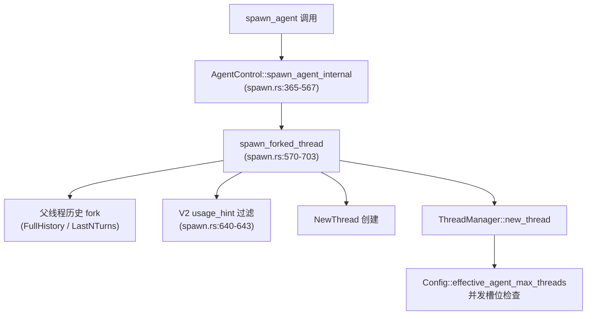

# Codex Subagent 系统分析

> 源码锚点：codex-rs/core/src/agent/control/spawn.rs, codex-rs/core/src/codex_delegate.rs, codex-rs/protocol/src/protocol.rs
> 更新时间：2026-07-30

---

## 1. 工作原理

### 1.1 核心架构

Codex Subagent 系统基于 `SessionSource::SubAgent` 枚举的三种机制，通过 `AgentControl` 和 `ThreadManager` 进行生命周期管理：

```rust
// codex-rs/protocol/src/protocol.rs:2760-2764
pub enum SessionSource {
    Internal(InternalSessionSource),
    SubAgent(SubAgentSource),    // Subagent 来源
    #[serde(other)]
    Unknown,
}

// codex-rs/protocol/src/protocol.rs:2831-2840
pub enum SubAgentSource {
    Review,                           // 内部委托：审查
    Compact,                          // 内部委托：压缩
    ThreadSpawn {                     // 用户协作：Spawn 工具
        parent_thread_id: ThreadId,
        depth: u32,
        agent_path: AgentPath,
        agent_role: Option<String>,
    },
    MemoryConsolidation,              // 内部委托：记忆合并
    Other(String),                    // 扩展：Guardian 等
}
```

### 1.2 创建流程

**用户协作 Subagent (ThreadSpawn)** 通过 `spawn_agent` 工具触发：



**内部委托 Subagent (Review/Compact)** 通过 `codex_delegate.rs` 创建：

```rust
// codex-rs/core/src/codex_delegate.rs:130-146
pub(crate) async fn run_codex_thread_one_shot(
    config: Config,
    ...
    subagent_source: SubAgentSource,  // Review / Compact / MemoryConsolidation
    ...
) -> Result<(Arc<Session>, SessionIo), CodexErr> {
    let session = Session::new(
        config,
        ...
        external_time_provider: Some(Arc::clone(&parent_session.services.time_provider)),
        inherited_multi_agent_version: Some(MultiAgentVersion::Disabled),  // 禁用嵌套
        ...
    ))
}
```

### 1.3 生命周期事件

Subagent 生命周期通过 `EventMsg` 变体传播：

```rust
// codex-rs/protocol/src/protocol.rs:1465-1472
pub enum EventMsg {
    CollabAgentSpawnBegin(CollabAgentSpawnBeginEvent),   // Agent 创建开始
    CollabAgentSpawnEnd(CollabAgentSpawnEndEvent),       // Agent 创建完成
    CollabAgentInteractionBegin(CollabAgentInteractionBeginEvent),  // 交互开始
    CollabAgentInteractionEnd(CollabAgentInteractionEndEvent),      // 交互结束
    ...
}

// codex-rs/protocol/src/protocol.rs:4228-4268
pub struct CollabAgentSpawnBeginEvent {
    pub call_id: String,
    pub agent_path: AgentPath,
    pub agent_role: Option<String>,
    pub agent_nickname: Option<String>,
}

pub struct CollabAgentRef {
    pub thread_id: ThreadId,
    pub agent_path: AgentPath,
    pub agent_nickname: Option<String>,
    pub agent_role: Option<String>,
}
```

活动状态通过 `SubAgentActivityEvent` 报告：

```rust
// codex-rs/protocol/src/protocol.rs:4335-4352
pub enum SubAgentActivityKind {
    Started,
    Interacted,
    Interrupted,
    Completed,
}

pub struct SubAgentActivityEvent {
    pub agent_path: AgentPath,
    pub kind: SubAgentActivityKind,
}
```

---

## 2. 配置方式

### 2.1 Feature Gate（功能开关）

Subagent 功能由 `MultiAgentVersion` 控制：

```rust
// codex-rs/protocol/src/protocol.rs:2659-2664
pub enum MultiAgentVersion {
    Disabled,    // 禁用多代理
    V1,          // 旧版 Collab 特性
    V2,          // 新版任务路径系统
}

// codex-rs/core/src/config/mod.rs:1521-1525
fn multi_agent_version_override(
    config_toml: &ConfigToml,
    features: &Features,
) -> MultiAgentVersion {
    if !features.multi_agent_v2.unwrap_or(true) {
        return MultiAgentVersion::Disabled;
    }
    // ...
}
```

### 2.2 [multi_agent_v2] 配置块

```toml
# codex-rs/core/src/config/mod.rs:1240-1290
[multi_agent_v2]
# 并发控制
max_concurrent_threads_per_session = 4  # 默认 4 (DEFAULT_MULTI_AGENT_V2_MAX_CONCURRENT_THREADS_PER_SESSION)

# 超时配置（毫秒）
min_wait_timeout_ms = 10000             # 最小等待超时
max_wait_timeout_ms = 3600000           # 最大等待超时（1小时）
default_wait_timeout_ms = 30000         # 默认等待超时（30秒）

# 提示文本
usage_hint_text = "..."                  # 通用提示
root_agent_usage_hint_text = "..."       # Root Agent 提示（DEFAULT_MULTI_AGENT_V2_ROOT_AGENT_USAGE_HINT_TEXT）
subagent_usage_hint_text = "..."         # Subagent 提示（DEFAULT_MULTI_AGENT_V2_SUBAGENT_USAGE_HINT_TEXT）
subagent_developer_instructions = "..."  # Subagent 开发者指令
multi_agent_mode_hint_text = "..."       # 多代理模式提示

# 工具命名空间
tool_namespace = "collaboration"         # 默认 "collaboration" (DEFAULT_MULTI_AGENT_V2_TOOL_NAMESPACE)

# 功能开关
hide_spawn_agent_metadata = false        # 隐藏 spawn 元数据
expose_spawn_agent_model_overrides = true  # 暴露 spawn 模型覆盖
wait_agent_enabled = true                # 启用 wait_agent 工具
```

### 2.3 全局配置项

```toml
# codex-rs/core/src/config/mod.rs:870-877
agent_max_threads = 6                      # 每会话最大线程数（默认 6）
agent_default_subagent_model = "gpt-5.6"   # Subagent 默认模型
agent_default_subagent_reasoning_effort = "high"  # Subagent 默认推理强度
agent_max_depth = 1                        # 最大嵌套深度（默认 1）
agent_interrupt_message_enabled = true     # 记录中断消息
```

### 2.4 Per-Spawn 参数

`spawn_agent` 工具调用时可覆盖配置：

```rust
// codex-rs/core/src/tools/handlers/multi_agents_spec.rs:120-175
pub struct SpawnAgentToolOptions {
    pub task: String,                      // 子任务描述
    pub name: Option<String>,              // Agent 名称（可选）
    pub model: Option<String>,             // 模型覆盖
    pub reasoning_effort: Option<ReasoningEffort>,  // 推理强度覆盖
    pub fork_turns: Option<String>,        // Fork 策略： "all" | "none" | N
    pub agent_path: Option<String>,        // Agent 路径
    pub role: Option<String>,              // Agent 角色
    pub wait: Option<bool>,                // 是否等待完成
    pub timeout_ms: Option<i64>,           // 等待超时
    pub environment_id: Option<String>,    // 环境 ID
    pub tools: Option<Vec<String>>,        // 工具限制
}
```

---

## 3. Subagent 分类

### 3.1 内部委托 Subagent (Internal Delegation)

**用途**：系统内部使用的专用代理，用户不可见

**类型**：
- `Review` - 代码审查
- `Compact` - 上下文压缩
- `MemoryConsolidation` - 长期记忆合并

**关键特性**：
```rust
// codex-rs/core/src/codex_delegate.rs:143
inherited_multi_agent_version: Some(MultiAgentVersion::Disabled)  // 禁用嵌套
```

**创建位置**：`codex-rs/core/src/codex_delegate.rs:130-146` (`run_codex_thread_one_shot`)

**特殊限制**：
- **无法再 spawn 其他 subagent**（`inherited_multi_agent_version: Disabled`）
- 无用户交互界面
- 生命周期由父会话完全控制

### 3.2 用户协作 Subagent (ThreadSpawn)

**用途**：通过 `spawn_agent` 工具显式创建的协作子代理

**创建条件**：
- `MultiAgentVersion::V2`
- `[multi_agent_v2] enabled = true`
- 并发槽位可用（`effective_agent_max_threads`）

**关键特性**：
```rust
// codex-rs/protocol/src/protocol.rs:2834-2840
ThreadSpawn {
    parent_thread_id: ThreadId,    // 父线程 ID
    depth: u32,                    // 嵌套深度（受 agent_max_depth 限制）
    agent_path: AgentPath,         // Agent 路径（如 /root/worker）
    agent_role: Option<String>,    // Agent 角色（如 "reviewer"）
}
```

**通信机制**：
- **父→子**：`InterAgentCommunication` 消息传递
- **子→父**：通过 `wait_agent` 工具返回结果
- **异步运行**：支持后台执行，父可继续工作

**工具集**（命名空间 `functions.collaboration.*`）：
- `spawn_agent` - 创建子代理
- `send_message` - 发送消息
- `followup_task` - 创建后续任务
- `wait_agent` - 等待完成
- `interrupt_agent` - 中断执行
- `list_agents` - 列出活跃代理
- `close_agent` - 关闭代理
- `resume_agent` - 恢复代理

### 3.3 Guardian Reviewer (Special Case)

**用途**：Guardian 安全审查专用代理

**标识方式**：
```rust
// guardian/review_session.rs:680
SubAgentSource::Other(GUARDIAN_REVIEWER_NAME)
```

**创建位置**：`codex-rs/guardian/src/review_session.rs`

**特殊机制**：
- 通过名称匹配识别，非独立枚举变体
- 继承父会话的安全策略
- 用于代码审查和安全检查

---

## 4. 与主 Agent 的特殊区别

### 4.1 继承关系

| 属性 | 主 Agent | Subagent (ThreadSpawn) | Subagent (Internal) |
|------|----------|------------------------|---------------------|
| **父线程** | 无 | `parent_thread_id` | `parent_thread_id` |
| **嵌套深度** | 0 | `depth` (受 `agent_max_depth` 限制) | N/A |
| **配置继承** | 完整配置 | Fork 父历史 + 部分覆盖 | 完全继承父配置 |
| **多代理版本** | V2 | V2 | **Disabled** |

### 4.2 并发控制

```rust
// codex-rs/core/src/config/mod.rs:1550-1564
pub(crate) fn effective_agent_max_threads(
    &self,
    multi_agent_version: MultiAgentVersion,
) -> Option<usize> {
    match multi_agent_version {
        MultiAgentVersion::V2 => self
            .multi_agent_v2
            .max_concurrent_threads_per_session,  // 优先使用 V2 配置
        MultiAgentVersion::Disabled | MultiAgentVersion::V1 => {
            self.agent_max_threads.or(DEFAULT_AGENT_MAX_THREADS)  // 回退到全局配置
        }
    }
}
```

**并发槽位管理**：
- V2 使用 `V2Residency` 槽位系统
- 内部委托不占用槽位
- 超过限制时 spawn 失败

### 4.3 历史继承策略

```rust
// codex-rs/core/src/agent/control/spawn.rs:63-65
pub(crate) enum SpawnAgentForkMode {
    FullHistory,      // 完整历史（默认）
    LastNTurns(usize), // 最近 N 轮
}
```

**Fork 行为**：
```rust
// codex-rs/core/src/agent/control/spawn.rs:656-658
if let SpawnAgentForkMode::LastNTurns(last_n_turns) = fork_mode {
    forked_rollout_items =
        truncate_rollout_to_last_n_fork_turns(forked_rollout_items, *last_n_turns);
}
```

**Usage Hint 过滤**：
```rust
// codex-rs/core/src/agent/control/spawn.rs:640-643
let multi_agent_v2_usage_hint_texts_to_filter: Vec<String> = if multi_agent_version == MultiAgentVersion::V2 {
    [
        parent_config.multi_agent_v2.root_agent_usage_hint_text.clone(),
        parent_config.multi_agent_v2.subagent_usage_hint_text.clone(),
    ].into_iter().flatten().collect()
} else { Vec::new() };
```

### 4.4 工具可用性

**主 Agent**：
- 完整工具集（shell, file, mcp, collaboration 等）
- 可调用 `spawn_agent` 创建子代理

**Subagent (ThreadSpawn)**：
- 继承父代理工具集
- **可再次 spawn 子代理**（V2 支持）
- 可用 `collaboration.*` 工具集

**Subagent (Internal)**：
- 受限工具集
- **无法 spawn 子代理**（`inherited_multi_agent_version: Disabled`）

### 4.5 生命周期差异

| 阶段 | 主 Agent | ThreadSpawn Subagent | Internal Subagent |
|------|----------|----------------------|-------------------|
| **创建** | 用户启动 | `spawn_agent` 调用 | 系统内部触发 |
| **输入** | 用户输入 | 父消息传递 | 父任务描述 |
| **输出** | 直接返回 | `wait_agent` 返回 | 内部消费 |
| **销毁** | 用户关闭 | 完成后自动清理 | 父会话控制 |

---

## 5. 深度和并发限制

### 5.1 深度限制

```rust
// codex-rs/core/src/config/mod.rs:873
pub agent_max_depth: i32,  // 默认 1 (DEFAULT_AGENT_MAX_DEPTH)
```

**嵌套规则**：
- `depth = 0` → Root Agent
- `depth = 1` → 一级 Subagent
- `depth > agent_max_depth` → Spawn 失败

**深度递增**：
```rust
// codex-rs/core/src/agent/control/spawn.rs
let depth = next_thread_spawn_depth(&session_source);  // 从父线程 depth + 1
```

### 5.2 并发限制

**V2 Residency 槽位系统**：
```rust
// codex-rs/core/src/agent/control/residency.rs:55-58
let capacity = config
    .effective_agent_max_threads(MultiAgentVersion::V2)
    .unwrap_or(usize::MAX);
Arc::clone(&self.v2_residency)
    .reserve_slot(state, capacity, protected_thread_id)
```

**槽位释放**：
- ThreadSpawn 完成后释放
- Internal subagent 不占用槽位
- Agent 关闭时释放所有子孙槽位

---

## 6. 关键源码位置

| 功能 | 文件 | 行号 |
|------|------|------|
| **SubAgentSource 枚举** | `codex-rs/protocol/src/protocol.rs` | 2831-2840 |
| **EventMsg 生命周期事件** | `codex-rs/protocol/src/protocol.rs` | 1465-1472 |
| **MultiAgentVersion** | `codex-rs/protocol/src/protocol.rs` | 2659-2664 |
| **AgentControl::spawn_agent** | `codex-rs/core/src/agent/control/spawn.rs` | 200-214 |
| **spawn_agent_internal** | `codex-rs/core/src/agent/control/spawn.rs` | 365-567 |
| **spawn_forked_thread** | `codex-rs/core/src/agent/control/spawn.rs` | 570-703 |
| **run_codex_thread_one_shot** | `codex-rs/core/src/codex_delegate.rs` | 130-146 |
| **effective_agent_max_threads** | `codex-rs/core/src/config/mod.rs` | 1550-1564 |
| **MultiAgentV2Config** | `codex-rs/core/src/config/mod.rs` | 1240-1290 |
| **spawn_agent 工具处理器** | `codex-rs/core/src/tools/handlers/multi_agents_v2/spawn.rs` | - |
| **V2 Residency** | `codex-rs/core/src/agent/control/residency.rs` | - |

---

## 7. 常量汇总

| 常量 | 值 | 源码位置 |
|------|-----|---------|
| `DEFAULT_AGENT_MAX_THREADS` | `Some(6)` | config/mod.rs:1057 |
| `DEFAULT_MULTI_AGENT_V2_MAX_CONCURRENT_THREADS_PER_SESSION` | `4` | config/mod.rs:1058 |
| `DEFAULT_MULTI_AGENT_V2_MIN_WAIT_TIMEOUT_MS` | `10000` | config/mod.rs:1059 |
| `DEFAULT_MULTI_AGENT_V2_MAX_WAIT_TIMEOUT_MS` | `3600000` | config/mod.rs:1060 |
| `DEFAULT_MULTI_AGENT_V2_DEFAULT_WAIT_TIMEOUT_MS` | `30000` | config/mod.rs:1061 |
| `DEFAULT_AGENT_MAX_DEPTH` | `1` | config/mod.rs:1065 |
| `DEFAULT_MULTI_AGENT_V2_TOOL_NAMESPACE` | `"collaboration"` | config/mod.rs:1087 |

---

## 8. 总结

Codex Subagent 系统是一个三层架构的多代理协作框架：

1. **内部委托层**（Review/Compact/MemoryConsolidation）- 系统内部使用，禁用嵌套
2. **用户协作层**（ThreadSpawn）- 用户可控，支持嵌套和消息传递
3. **扩展层**（Guardian 等）- 通过 `Other` 变体扩展特殊用途

配置采用三层控制：Feature Gate → 全局配置块 → Per-Spawn 参数，允许从粗到细的粒度调整。深度和并发限制确保系统可控性，V2 Residency 槽位系统提供高效的并发管理。
