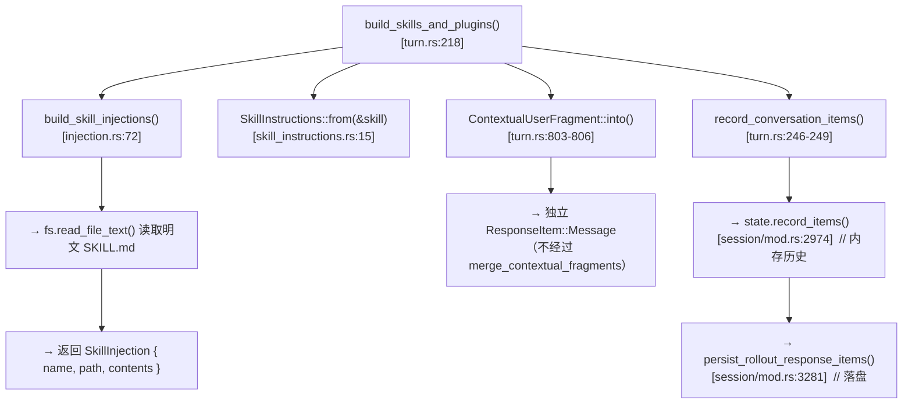
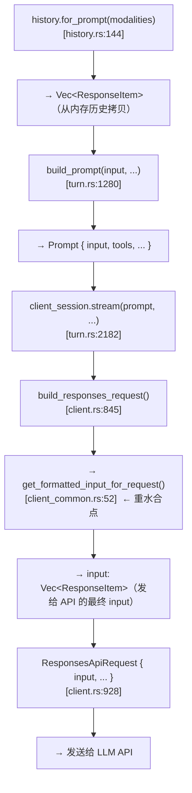
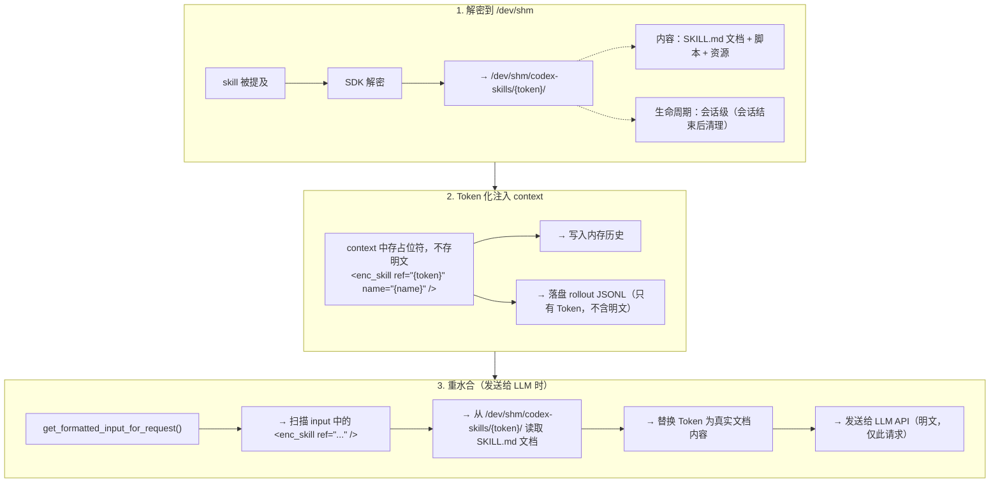

# fm-agent-security Skill 加解密架构（主 Agent / Ephemeral + Token 重水合）

> 日期：2026-07-30 · 版本 v2.0（设计阶段）
> 前序：v1.0（Subagent + Token 化，废弃——状态管理过重）
>
> **设计要点**：
> 1. 加密/解密由数字信封 SDK 实现，不关心加解密算法和 key 存储
> 2. 内存中也避免明文驻留——context 中只存 Token，发送给 LLM 时才重水合注入真实内容
> 3. 加密 Skill 下的脚本可直接执行，解密到 `/dev/shm`
> 4. 拦截对 `/dev/shm` 中非文档内容的读取
> 5. 不暴露解密路径位置给用户/模型

---

## 一、设计约束

| 约束 | 说明 |
|------|------|
| **执行模型** | 主 Agent 直接操作，无 Subagent |
| **加密/解密** | 数字信封 SDK 实现，不用关心加解密和 key 管理 |
| **内存安全** | context 中不存明文，只存 Token/占位符 |
| **重水合** | 发送给 LLM 时才注入真实 Skill 内容 |
| **落盘策略** | rollout 中只落 Token，不含明文（ephemeral 的自然结果） |
| **脚本执行** | 解密到 `/dev/shm`，脚本可直接执行 |
| **路径隐藏** | 不暴露解密路径位置给用户/模型 |
| **读取拦截** | 拦截对 `/dev/shm` 中非文档内容的读取 |
| **安全边界** | 运行时安全由未来输入端 safe guard 模型负责 |

---

## 二、Codex 机制验证

### 2.1 Skill 注入链路



### 2.2 LLM 请求构建链路（重水合注入点）



**`get_formatted_input_for_request`** (client_common.rs:52-59) 是最后一跳：
```rust
pub(crate) fn get_formatted_input_for_request(&self, use_responses_lite: bool) -> Vec<ResponseItem> {
    let mut input = self.input.clone();
    if use_responses_lite {
        strip_image_details(&mut input);  // ← 现有 content 转换先例
    }
    input
}
```

`strip_image_details` 证明在该点遍历修改 `ResponseItem::Message.content` 是惯用模式。

### 2.3 PreToolUse Hook 拦截

shell/exec 命令通过 `pre_tool_use_payload` 暴露 `command` 字段（`shell_command.rs:250`、`exec_command.rs:415`）。`PreToolUseHookResult::Blocked` (registry.rs:597) 可阻止执行。

### 2.4 /dev/shm 已被 bwrap 支持

`sandbox.rs:171` 和 `landlock.rs:321-354` 证明 `/dev/shm` 可作为 writable root 在沙箱内使用。

### 2.5 关键发现：多场景 LLM 请求路径

验证了 Codex 中所有向 LLM 发送请求的路径，它们都经过同一个重水合点：

| 场景 | 构建 Prompt | 发送路径 | 经过重水合点? |
|------|-----------|---------|-------------|
| **常规 turn** | `history.for_prompt()` → `build_prompt()` (turn.rs:1280) | `client_session.stream()` (turn.rs:2182) → `build_responses_request()` → `get_formatted_input_for_request()` | ✅ |
| **Compaction** | `history.for_prompt()` → `Prompt { input }` (compact_remote_request.rs:61, compact_remote_v2_attempt.rs:69) | `client_session.stream()` → `build_responses_request()` → `get_formatted_input_for_request()` | ✅ |
| **Guardian review** | 不走主 context—独立的 review session | `review_session.rs` 独立构建 prompt | ❌ 但**不需要**（见下） |

**Guardian 为什么不需要重水合**：`collect_guardian_transcript_entries`（`guardian/prompt.rs:419`）通过 `is_contextual_user_message_content`（`event_mapping.rs:59`）过滤。SkillInstructions 已在 `CONTEXTUAL_USER_FRAGMENTS` 列表中（`contextual_user_message.rs:54`），所以 Guardian **完全跳过** skill 内容（无论明文还是 Token）。Guardian 看不到 skill，也不需要看——它审查的是工具调用，不是 skill 内容。

---

## 三、架构设计

### 3.1 三阶段流水线



### 3.2 /dev/shm 布局

```
/dev/shm/codex-skills/{token}/
├── SKILL.md              # 文档内容（重水合时读取）
├── scripts/              # 脚本文件（可直接执行）
│   ├── build.sh
│   └── analyze.py
└── resources/            # 资源文件
    └── config.json
```

**关键**：
- 脚本可直接执行（`/dev/shm/codex-skills/{token}/scripts/build.sh`）
- 但模型不知道这个绝对路径（context 中只有 Token，不暴露路径）
- SKILL.md 文档内容通过重水合注入 LLM
- 非 /dev/shm 中的脚本可通过相对路径在 SKILL.md 中引用

### 3.3 安全拦截

**PreToolUse hook** 拦截对 `/dev/shm/codex-skills/` 路径的读取：

```rust
// 伪代码 — PreToolUse hook
fn pre_tool_use(tool_name: &str, tool_input: &Value) -> HookResult {
    let command = tool_input.get("command").and_then(|v| v.as_str());
    if let Some(cmd) = command {
        // 拦截直接读取 /dev/shm/codex-skills/ 的命令
        if cmd.contains("/dev/shm/codex-skills/") 
            && !is_allowed_execution(cmd) {
            return HookResult::Blocked(
                "Direct access to encrypted skill storage is not allowed"
            );
        }
    }
    HookResult::Continue
}
```

**拦截规则**：
- ❌ `cat /dev/shm/codex-skills/{token}/scripts/build.sh` — 拦截（读取脚本源码）
- ❌ `ls /dev/shm/codex-skills/` — 拦截（探测目录结构）
- ✅ `bash /dev/shm/codex-skills/{token}/scripts/build.sh` — 允许（执行脚本，不暴露内容）
- ✅ skill 文档中引用的相对路径执行 — 允许

---

## 四、数据流全链路

```mermaid
flowchart TD
    subgraph L["解密加载"]
        L1["用户提及 $skill-name"]
        L1 --> L2["→ 元数据库查询 name → encrypted_path, token"]
        L2 --> L3["→ SDK 数字信封解密 → /dev/shm/codex-skills/{token}/"]
        L3 --> L4["→ context 注入 Token: &lt;enc_skill ref=&quot;{token}&quot; name=&quot;{name}&quot; /&gt;"]
        L4 --> L5["→ record_conversation_items() → 内存历史 + rollout JSONL（只有 Token）"]
    end
    subgraph R["发送给 LLM — 重水合"]
        R1["run_sampling_request()"]
        R1 --> R2["→ history.for_prompt() → input: Vec&lt;ResponseItem&gt;（含 Token）"]
        R2 --> R3["→ build_prompt() → Prompt { input }"]
        R3 --> R4["→ client_session.stream(prompt)"]
        R4 --> R5["→ get_formatted_input_for_request()  ← 重水合"]
        R5 --> R6["→ 扫描 ResponseItem::Message.content"]
        R6 --> R7["→ 找到 &lt;enc_skill ref=&quot;{token}&quot; /&gt;"]
        R7 --> R8["→ 从 /dev/shm/codex-skills/{token}/SKILL.md 读取文档"]
        R8 --> R9["→ 替换 Token 为真实文档内容"]
        R9 --> R10["→ 发送给 LLM API（明文，仅此请求）"]
    end
    subgraph EX["脚本执行"]
        EX1["模型请求 shell 执行"]
        EX1 --> EX2["→ PreToolUse hook 检查命令"]
        EX2 --> EX3{"命令类型？"}
        EX3 -->|"执行脚本<br/>(bash/python + /dev/shm 路径)"| EX4["允许"]
        EX3 -->|"读取源码<br/>(cat/less/head + /dev/shm 路径)"| EX5["拦截"]
        EX4 --> EX6["脚本在 /dev/shm 中可直接运行"]
    end
    subgraph U["卸载"]
        U1["Turn N+1 不提及 skill"]
        U1 --> U2["→ mentioned_skills 为空 → 不注入新 Token"]
        U2 --> U3["→ 旧 Token 仍在历史中（但不含明文，只是占位符）"]
        U3 --> U4["→ /dev/shm/codex-skills/{token}/ 在会话结束后清理"]
    end
    subgraph REC["会话恢复"]
        REC1["读取 rollout JSONL → 只有 Token，不含明文"]
        REC1 --> REC2["→ 重水合时 Token 指向的 /dev/shm 内容可能已清理"]
        REC2 --> REC3["→ 重新提及 skill 时重新解密到 /dev/shm"]
    end
```



### 落盘数据验证

| 存储位置 | 内容 | 含明文? |
|---------|------|---------|
| 加密 Skill 文件（SDK 管理） | 数字信封密文 | ❌ 加密 |
| 元数据库 | name, token, encrypted_path | ❌ 只有标记 |
| rollout JSONL | `<enc_skill ref="{token}" />` | ❌ 只有 Token |
| `/dev/shm/codex-skills/{token}/` | 解密后的明文 | ⚠️ 内存文件系统，不落盘 |
| **context 内存**（重水合前） | 只有 Token | ❌ |
| **LLM 请求**（重水合后） | 真实文档内容 | ⚠️ 仅请求瞬间 |

---

## 五、实施改动点

### 改动 1：Token 化注入（`core-skills/src/`）

**修改 `build_skill_injections`**（`injection.rs:72-200`）：
- 不再 `read_file_text()` 读取明文
- 改为：SDK 解密到 `/dev/shm` → context 中注入 Token 占位符

**修改 `SkillInstructions`**（`skill_instructions.rs`）：
- `body()` 返回 `<enc_skill ref="{token}" name="{name}" />`
- 不再包含明文 `contents`

```rust
// 伪代码
impl ContextualUserFragment for SkillInstructions {
    fn body(&self) -> String {
        if self.is_encrypted {
            format!("<enc_skill ref=\"{}\" name=\"{}\" />", self.token, self.name)
        } else {
            format!("\n<name>{}</name>\n<path>{}</path>\n{}\n",
                self.name, self.path, self.contents)  // 明文 skill 向后兼容
        }
    }
}
```

### 改动 2：重水合（`core/src/client_common.rs`）

**修改 `get_formatted_input_for_request`**（`client_common.rs:52-59`）：
- 新增 Token → 真实内容的替换逻辑

```rust
// 伪代码
pub(crate) fn get_formatted_input_for_request(&self, use_responses_lite: bool) -> Vec<ResponseItem> {
    let mut input = self.input.clone();
    if use_responses_lite {
        strip_image_details(&mut input);
    }
    rehydrate_encrypted_skills(&mut input);  // ← 新增
    input
}

fn rehydrate_encrypted_skills(input: &mut [ResponseItem]) {
    for item in input.iter_mut() {
        if let ResponseItem::Message { content, .. } = item {
            for content_item in content.iter_mut() {
                if let ContentItem::InputText { text } = content_item {
                    // 找到 <enc_skill ref="{token}" /> → 读取 /dev/shm 内容替换
                    text = rehydrate_skill_tokens(text);
                }
            }
        }
    }
}
```

### 改动 3：PreToolUse 拦截（`core/src/hooks/` 或 plugin）

拦截 shell/exec 命令中对 `/dev/shm/codex-skills/` 的非执行访问。

### 改动 4：/dev/shm 生命周期管理

- 会话开始时：按需解密（skill 被提及时）
- 会话结束时：清理 `/dev/shm/codex-skills/{token}/`
- 会话恢复时：重新解密

---

## 六、设计要点总结

### 与 v1.0 的核心区别

| 维度 | v1.0 Subagent | v2.0 本文 |
|------|-------------|----------|
| 需要 Subagent 吗 | 是 | **否** |
| 状态管理 | Token 生命周期 + 会话隔离 | **轻量**（/dev/shm 会话级） |
| 复杂度 | 最高 | 中 |
| context 中存什么 | Token | Token |
| 内存中有明文吗 | 否（Subagent 隔离） | **否**（只有 Token，重水合时才出现） |
| rollout 含明文吗 | 否 | 否 |
| 脚本执行 | SubAgent 内 | /dev/shm 直接执行 |
| 加解密/key 管理 | codex-secrets + age 详设 | **数字信封 SDK，不管** |

---

## 七、源码验证锚点

| 锚点 | 文件:行号 | 验证内容 |
|------|---------|---------|
| `get_formatted_input_for_request` | `client_common.rs:52-59` | **重水合注入点** |
| `strip_image_details` | `client_common.rs:57` | content 转换先例 |
| `build_responses_request` | `client.rs:845-936` | LLM 请求构建 |
| `client_session.stream(prompt)` | `turn.rs:2182` | prompt 发送给 client |
| `for_prompt` | `history.rs:144` | history → prompt input |
| `build_prompt` | `turn.rs:1280` | Prompt 构建函数 |
| Skill 注入 chokepoint | `turn.rs:246-249` | `record_conversation_items` |
| `PreToolUseHookResult::Blocked` | `tools/registry.rs:597` | hook 拦截能力 |
| shell hook payload | `tools/handlers/shell/shell_command.rs:250` | 暴露 command 字段 |
| exec hook payload | `tools/handlers/unified_exec/exec_command.rs:415` | 暴露 command 字段 |
| /dev/shm writable root | `exec/tests/suite/sandbox.rs:171` | bwrap 支持 |
| /dev/shm landlock | `tests/suite/landlock.rs:321-354` | 沙箱内可写 |
| `SkillInstructions::type_markers` | `skill_instructions.rs:31-33` | `("<skill>", "</skill>")` |
| `ContextualUserFragment::into` | `context-fragments/src/fragment.rs:84-96` | → Message |

---

## 八、多场景分析

### 8.1 常规单会话单 Agent

**状态：✅ Work**

- skill 被提及 → 解密到 `/dev/shm/codex-skills/{session_id}/{token}/`
- context 中存 Token，重水合时从 /dev/shm 读取
- 卸载 = 下轮不提及

### 8.2 多会话

**问题：`/dev/shm` 是机器级共享文件系统**

两个 Codex 进程同时运行，它们的 `/dev/shm/codex-skills/` 目录如果用扁平 token，会发生路径冲突。

**修复**：token 命名空间加入 `session_id`（或 `process_id`）：
```
/dev/shm/codex-skills/{session_id}/{token}/
```

重水合时从 `{session_id}` 子目录读取。每个会话只看到自己的解密内容，天然隔离。

清理时只清理 `{session_id}/` 子目录，不影响其他会话。

**状态：✅ Work（加 session_id 命名空间）**

### 8.3 Subagent fork 调用 Skill

**子进程机制**：`spawn.rs:641` 的 `load_agent_model_context` 从 parent 的 **rollout JSONL** 加载历史。如果 rollout 中只有 Token（`<enc_skill ref="..." />`），子 Agent 继承的也是 Token。

**问题 1：子 Agent 的重水合需要 /dev/shm 访问**

子 Agent 是同机进程，/dev/shm 机器级共享，技术上可访问父 Agent 的解密目录。但需要 token 带上 parent session_id 才能定位。

**问题 2：SubAgent 运行在 bwrap 沙箱中**

`spawn.rs:79` 的 `keep_forked_rollout_item` 过滤逻辑会保留 skill 的 ResponseItem。子 Agent 在沙箱中执行时，bwrap 默认不挂载 `/dev/shm`（除非显式添加为 writable root）。如果子 Agent 沙箱不包含 `/dev/shm/codex-skills/`，重水合会找不到文件。

**修复方案**：
1. Token 格式携带路径线索：`<enc_skill ref="{session_id}/{token}" name="..." />`
2. 子 Agent 的 bwrap 配置中将 parent 的 `/dev/shm/codex-skills/{session_id}/` 加入 `extra_bind_ro`
3. 重水合时从绑定路径读取

或者更简单的方案：**子 Agent 不继承加密 skill Token**。

在 `keep_forked_rollout_item`（`spawn.rs:47-81`）中增加过滤规则，检测到 `<enc_skill>` 标记时丢弃该 item（类似已有的 `AgentMessage` 被丢弃）。子 Agent 需要某个 skill 时自行重新提及 `$skill-name` 触发解密。

**状态：⚠️ 需要决策——继承还是丢弃**

| 方案 | 优点 | 缺点 |
|------|------|------|
| **继承**（+ bwrap 绑定 /dev/shm） | 子 Agent 自动获得父注入的 skill 上下文 | 沙箱配置复杂；跨进程共享 /dev/shm 有安全顾虑 |
| **丢弃** | 简单，无跨进程共享 | 子 Agent 需要重新提及 skill；fork 的上下文不完整 |

**推荐丢弃**——与 ephemeral 设计哲学一致，skill 本质是 per-turn 参考文档，不需要跨 fork 传播。

### 8.4 Compaction

**状态：✅ Work，但需确认重水合策略**

Compaction 走 `client_session.stream(prompt)`（`compact_remote_v2_attempt.rs:95`）→ `build_responses_request()` → `get_formatted_input_for_request()`。**重水合会触发**，compaction 模型看到真实 skill 内容，能正常摘要。

**但注意**：compaction 的目的是压缩历史。如果重水合将 Token 替换为完整 SKILL.md，compaction 请求的 input 会变大。这不是 bug——compaction 本身就是为了处理这种情况。摘要后的历史中，skill 内容会被压缩为简短摘要（不含 Token，也不含明文，而是模型的自然语言摘要）。

### 8.5 Guardian Review

**状态：✅ Work（无需改动）**

`SkillInstructions` 已在 `CONTEXTUAL_USER_FRAGMENTS` 列表中（`contextual_user_message.rs:54`）。Guardian 的 `collect_guardian_transcript_entries`（`guardian/prompt.rs:419-434`）通过 `is_contextual_user_message_content` 跳过所有 skill 消息。Guardian **既看不到 Token 也看不到明文**——这是现有行为，Token 化不会改变。

### 8.6 总结

| 场景 | Work? | 需要改动? |
|------|-------|---------|
| 常规单会话 | ✅ | 无 |
| 多会话 | ✅ | token 加 session_id 命名空间 |
| Subagent fork | ⚠️ | 在 `keep_forked_rollout_item` 中丢弃 `<enc_skill>` Token（推荐） |
| Compaction | ✅ | 重水合自动生效 |
| Guardian | ✅ | 现有机制已跳过 skill |

---

## 九、风险

| 风险 | 影响 | 缓解 |
|------|------|------|
| /dev/shm 空间不足 | 解密失败 | 限制 skill 总大小 + 清理策略 |
| 重水合性能（每次 LLM 请求都读取 /dev/shm） | 延迟 | /dev/shm 是内存文件系统，读取 <1ms |
| Token 在历史中残留 | Token 指向已清理的 /dev/shm | 重水合时检测 Token 失效，提示重新提及 |
| 脚本执行暴露路径 | 安全风险 | PreToolUse hook 拦截非执行访问 |
| compaction 读到 Token | 摘要不含 skill 内容 | Token 不是明文，compaction 正常工作 |
| 明文 skill 不兼容 | 破坏现有功能 | `is_encrypted: false` 走原有路径 |
